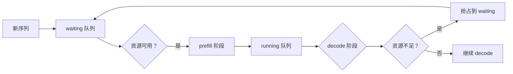
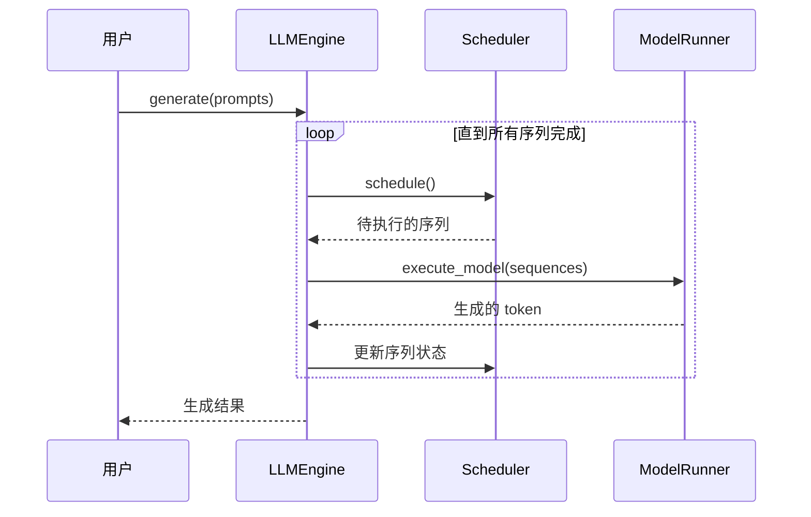
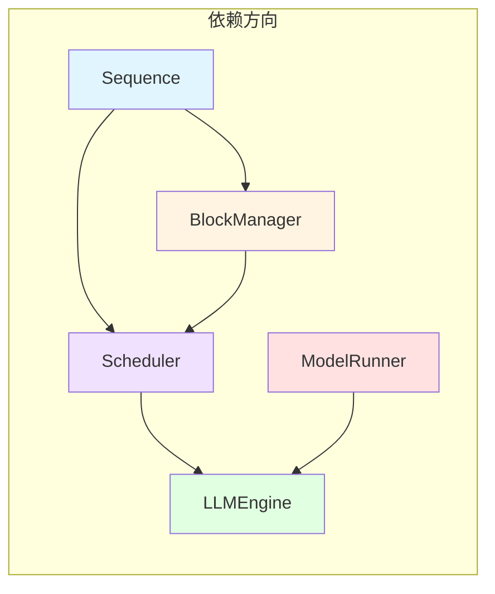

# Engine 模块学习顺序

## 从简单到复杂，从底层到上层

```mermaid
graph TD
    subgraph 第一层：基础数据结构
        Sequence["sequence.py<br/>238 行<br/>序列数据类"]
    end
    
    subgraph 第二层：资源管理
        BlockManager["block_manager.py<br/>347 行<br/>KV Cache 内存管理"]
    end
    
    subgraph 第三层：调度策略
        Scheduler["scheduler.py<br/>71 行<br/>序列调度器"]
    end
    
    subgraph 第四层：模型执行
        ModelRunner["model_runner.py<br/>251 行<br/>模型加载与执行"]
    end
    
    subgraph 第五层：引擎总控
        LLMEngine["llm_engine.py<br/>93 行<br/>统一引擎接口"]
    end
    
    Sequence --> BlockManager
    BlockManager --> Scheduler
    Sequence --> Scheduler
    Scheduler --> LLMEngine
    ModelRunner --> LLMEngine
    
    style Sequence fill:#e1f5ff
    style BlockManager fill:#fff4e1
    style Scheduler fill:#f0e1ff
    style ModelRunner fill:#ffe1e1
    style LLMEngine fill:#e1ffe1
```

## 推荐学习路径

### 1️⃣ Sequence (序列) - 基础数据结构

**文件**: `sequence.py` (238 行)

**核心职责**:
- 表示推理的基本单位：一个序列
- 管理 token IDs、状态、KV Cache 块表
- 实现状态机：WAITING → RUNNING → FINISHED

**为什么先学**:
- 最简单直观的数据类
- 是其他所有模块的操作对象
- 不涉及复杂算法

**关键概念**:
```python
class Sequence:
    block_table: list[int]      # KV Cache 物理块 ID 列表
    status: SequenceStatus      # 调度状态
    token_ids: list[int]        # 序列的所有 token
    num_cached_tokens: int      # 已缓存的 token 数 (前缀缓存优化)
```

---

### 2️⃣ BlockManager (块管理器) - 资源管理

**文件**: `block_manager.py` (347 行)

**核心职责**:
- 管理 GPU 上的 KV Cache 内存块
- 实现前缀缓存 (Prefix Caching) 优化
- 引用计数管理共享块

**为什么第二学**:
- 依赖 Sequence，为其分配内存块
- 算法较复杂 (哈希、引用计数)
- 是 Scheduler 的底层依赖

**关键概念**:
```python
class BlockManager:
    blocks: List[Block]                    # 所有物理块
    hash_to_block_id: Map[int, int]        # 前缀缓存哈希表
    free_block_ids: deque[int]             # 空闲块队列
    used_block_ids: set[int]               # 已使用块集合
    
    allocate(seq)      # 为序列分配块
    deallocate(seq)    # 回收序列的块
    may_append(seq)    # 动态追加新块
```

---

### 3️⃣ Scheduler (调度器) - 调度策略

**文件**: `scheduler.py` (71 行)

**核心职责**:
- 决定哪个序列何时执行
- 管理 prefill 和 decode 阶段
- 处理资源不足时的抢占 (preemption)

**为什么第三学**:
- 依赖 Sequence 和 BlockManager
- 代码量少但逻辑关键
- 承上启下：使用底层资源，服务上层引擎

**关键概念**:
```python
class Scheduler:
    waiting: deque[Sequence]     # 等待调度的序列
    running: deque[Sequence]     # 正在执行的序列
    block_manager: BlockManager  # 底层资源管理器
    
    schedule() -> tuple[list[Sequence], bool]  # 调度决策
    add(seq: Sequence)                       # 添加新序列
    preempt(seq: Sequence)                   # 抢占资源
```

**调度流程**:


---

### 4️⃣ ModelRunner (模型执行器) - 模型执行

**文件**: `model_runner.py` (251 行)

**核心职责**:
- 加载 HuggingFace 模型
- 分配 GPU 内存 (KV Cache)
- 执行模型前向传播
- 支持多进程张量并行

**为什么第四学**:
- 相对独立，主要与模型交互
- 为 LLMEngine 提供执行能力
- 涉及分布式通信 (NCCL)

**关键概念**:
```python
class ModelRunner:
    model: nn.Module              # HF 模型
    device: torch.device          # GPU 设备
    kvcache: tuple[K, V]          # KV Cache 张量
    
    load_model()                  # 加载模型权重
    init_kvcache()                # 初始化 KV Cache
    execute_model()               # 执行前向传播
```

---

### 5️⃣ LLMEngine (引擎) - 统一接口

**文件**: `llm_engine.py` (93 行)

**核心职责**:
- 整合 Scheduler 和 ModelRunner
- 提供 `generate()` 统一接口
- 管理推理主循环

**为什么最后学**:
- 代码量最少但最上层
- 依赖所有其他模块
- 是系统的入口点

**关键概念**:
```python
class LLMEngine:
    scheduler: Scheduler         # 序列调度器
    model_runner: ModelRunner    # 模型执行器
    
    generate(prompts, params)    # 统一生成接口
    _run_engine()                # 推理主循环
```

**引擎工作流程**:


---

## 依赖关系总结



| 模块 | 依赖 | 被依赖 | 复杂度 |
|------|------|--------|--------|
| Sequence | 无 | BlockManager, Scheduler | ⭐ |
| BlockManager | Sequence | Scheduler | ⭐⭐⭐ |
| Scheduler | Sequence, BlockManager | LLMEngine | ⭐⭐ |
| ModelRunner | 无 | LLMEngine | ⭐⭐⭐ |
| LLMEngine | Scheduler, ModelRunner | 用户/应用 | ⭐ |

## 学习建议

1. **先读 Sequence** - 理解数据结构
2. **再读 BlockManager** - 理解内存管理 (重点：前缀缓存、引用计数)
3. **然后读 Scheduler** - 理解调度策略 (重点：prefill/decode 分离)
4. **接着读 ModelRunner** - 理解模型执行 (可选：张量并行)
5. **最后读 LLMEngine** - 理解整体流程

</content>
</write_file>