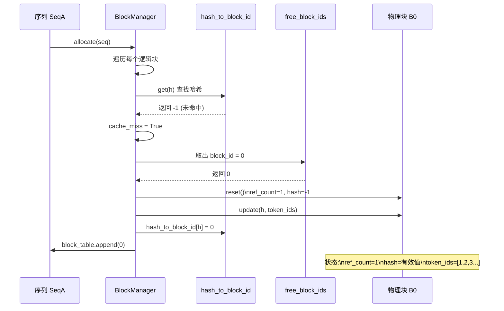
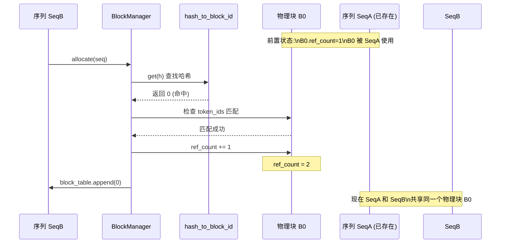
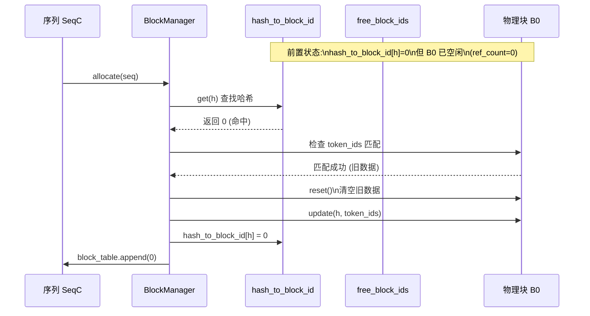
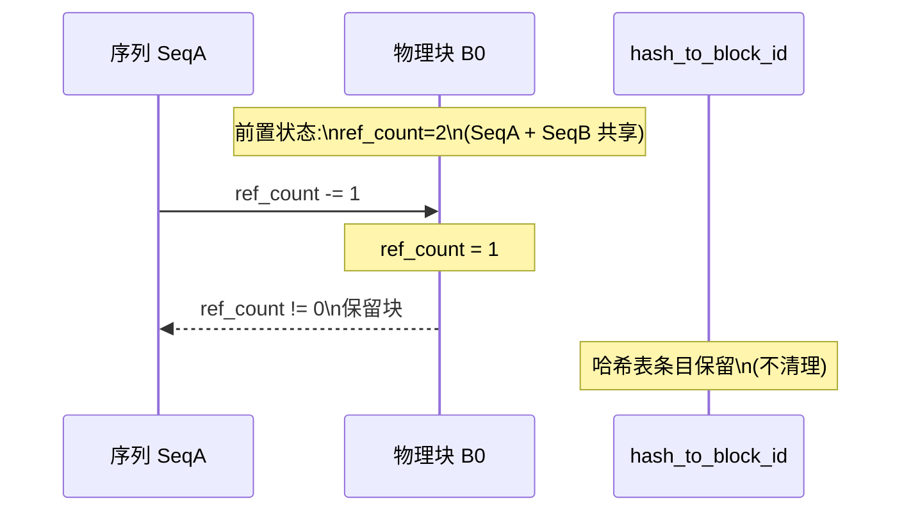
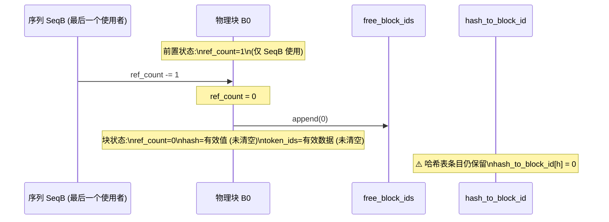
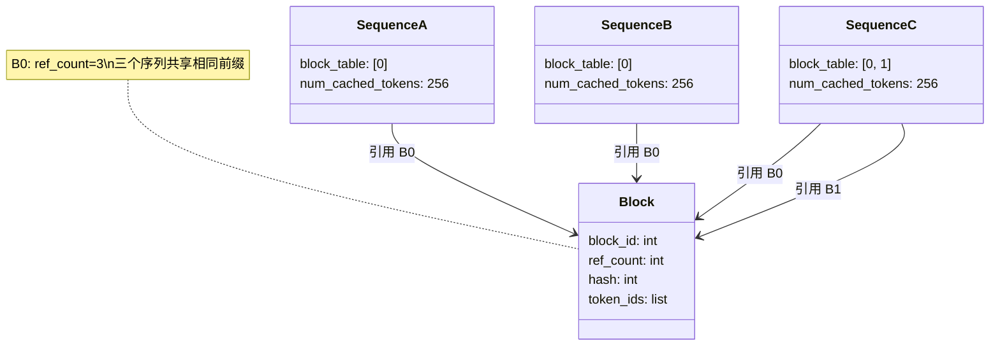

# BlockManager 详解

## 一、概述

BlockManager 是 nano-vLLM 中负责管理 KV Cache 物理内存块的核心组件。它通过**前缀缓存（Prefix Caching）**和**引用计数**技术，实现高效的 GPU 内存复用。

### 1.1 核心职责

| 职责 | 说明 |
|------|------|
| **块分配** | 为序列分配 KV Cache 物理块 |
| **前缀缓存** | 通过哈希去重复用相同前缀的 KV Cache |
| **引用计数** | 管理多序列共享块的引用关系 |
| **动态扩展** | 序列增长时追加新块 |

### 1.2 核心概念

#### 物理块 vs 逻辑块

```
物理块（Physical Block）
├── 固定大小的 GPU 内存区域
├── 容量：block_size tokens（默认 256）
└── 由 BlockManager 统一管理

逻辑块（Logical Block）
├── 序列视角的块划分
├── 第 i 个逻辑块 → 映射到某个物理块
└── 通过 block_table 建立映射关系
```

#### Block Table（块表）

每个 Sequence 维护一个 `block_table`，记录逻辑块到物理块的映射：

```python
# 序列的 block_table
seq.block_table = [5, 3, 8]

# 含义：
# 逻辑块 0 → 物理块 5
# 逻辑块 1 → 物理块 3
# 逻辑块 2 → 物理块 8
```

---

## 二、前缀缓存（Prefix Caching）

### 2.1 问题背景

在 LLM 推理中，多个请求可能共享相同的前缀：

```
请求 1: "请介绍一下 Python" → "Python 是一种编程语言..."
请求 2: "请介绍一下 Python 的历史" → "Python 的历史始于 1989 年..."
请求 3: "请介绍一下 Python 的应用场景" → "Python 可用于 Web 开发..."
         ↑ 相同前缀
```

如果每个请求都独立计算 KV Cache，会造成大量重复计算。前缀缓存通过**哈希去重**复用相同前缀的 KV Cache。

### 2.2 链式哈希计算

```python
@classmethod
def compute_hash(cls, token_ids: list[int], prefix: int = -1) -> int:
    """
    计算 token 序列的哈希值，支持链式计算。

    链式哈希确保：
    - 相同前缀的序列产生相同哈希
    - 哈希可以增量计算，无需重新处理完整数据
    """
    h = xxhash.xxh64()
    if prefix != -1:
        h.update(prefix.to_bytes(8, "little"))  # 前缀哈希
    h.update(np.array(token_ids).tobytes())     # 当前块 token
    return h.intdigest()
```

### 2.3 `h.update()` 详解

`update()` 是哈希算法的**增量更新**操作，用于分块计算哈希。

#### 两种哈希计算方式

**方式 1：一次性计算**
```python
data = b"hello world"
h = xxhash.xxh64(data)  # 直接计算完整数据
```

**方式 2：增量计算（`update`）**
```python
h = xxhash.xxh64()      # 创建空哈希对象
h.update(b"hello ")     # 更新第一部分
h.update(b"world")      # 更新第二部分
result = h.intdigest()  # 得到最终哈希
```

**关键：两种方式结果相同！**

#### 链式哈希原理

```
块 1: [1, 2, 3, ..., 256]
    → hash1 = xxh64([1,2,3,...,256])

块 2: [257, 258, ..., 512]
    → hash2 = xxh64(hash1 + [257,258,...,512])
              ↑
         前缀哈希（8 字节）

块 3: [513, 514, ..., 768]
    → hash3 = xxh64(hash2 + [513,514,...,768])
```

#### 为什么要用 `update`？

| 原因 | 说明 |
|------|------|
| **内存效率** | 不需要拼接大缓冲区，避免内存拷贝 |
| **流式计算** | 数据可以分片到达，边接收边计算 |
| **链式结构** | 自然支持前缀哈希的嵌套计算 |

---

## 三、引用计数管理

### 3.1 问题背景

多个序列可能共享同一个物理块（前缀缓存命中时），需要追踪每个块被多少序列使用。

### 3.2 引用计数规则

```python
# 分配新块时
block.ref_count = 1  # 初始为 1（分配者持有）

# 缓存命中共享时
block.ref_count += 1  # 增加引用

# 回收时
block.ref_count -= 1  # 减少引用
if block.ref_count == 0:
    # 引用归零，真正释放到空闲池
    deallocate_block(block_id)
```

### 3.3 状态转换图

```mermaid
stateDiagram-v2
    [*] --> 空闲状态 : Block 初始化

    state 空闲状态 {
        ref_count = 0
        hash = -1
        token_ids = []
        在 free_block_ids 队列中
    }

    state 已分配状态 {
        ref_count >= 1
        hash = 有效值/-1
        token_ids = 有效数据
        在 used_block_ids 集合中
    }

    state 哈希表注册状态 {
        在 hash_to_block_id 中
        可用于前缀缓存复用
    }

    空闲状态 --> 已分配状态 : _allocate_block()\n(分配新块/复用空闲块)
    已分配状态 --> 空闲状态 : _deallocate_block()\n(ref_count 降为 0)
    已分配状态 --> 哈希表注册状态 : 块填满时\n计算哈希并注册
```

---

## 四、块分配流程

### 4.1 缓存未命中 (Cache Miss) 流程



### 4.2 缓存命中 - 块被其他序列使用 (共享)



### 4.3 缓存命中 - 块已空闲 (复用)



---

## 五、块回收 (Deallocate) 流程

### 5.1 块部分回收 (ref_count > 0)



### 5.2 块完全回收 (ref_count = 0)



---

## 六、块追加（动态扩展）

当序列在 decode 阶段增长时，可能需要追加新块。

### 6.1 三种情况

```python
def may_append(self, seq: Sequence):
    block_table = seq.block_table
    last_block = blocks[block_table[-1]]

    if len(seq) % block_size == 1:
        # 情况 1：跨块边界，需要新块
        # 例如：256 → 257
        assert last_block.hash != -1

        block_id = free_block_ids[0]
        _allocate_block(block_id)
        block_table.append(block_id)

    elif len(seq) % block_size == 0:
        # 情况 2：块刚好填满，计算哈希
        # 例如：len=256, 512
        assert last_block.hash == -1

        token_ids = seq.block(seq.num_blocks - 1)

        # 计算前缀哈希
        if len(block_table) > 1:
            prefix = blocks[block_table[-2]].hash
        else:
            prefix = -1

        h = compute_hash(token_ids, prefix)

        # 更新块并注册到哈希表
        last_block.update(h, token_ids)
        hash_to_block_id[h] = last_block.block_id

    else:
        # 情况 3：块内追加，无需操作
        # 例如：257 → 300
        assert last_block.hash == -1
```

### 6.2 图示

```
block_size = 256

len=255 → len=256:  情况 2（填满，计算哈希）
len=256 → len=257:  情况 1（跨边界，分配新块）
len=257 → len=300:  情况 3（块内追加，无操作）
len=511 → len=512:  情况 2（填满，计算哈希）
len=512 → len=513:  情况 1（跨边界，分配新块）
```

---

## 七、数据结构

### 7.1 BlockManager 数据结构

| 数据结构 | 类型 | 用途 |
|---------|------|------|
| `blocks` | `list[Block]` | 所有物理块数组 |
| `hash_to_block_id` | `dict[int, int]` | 哈希 → 物理块 ID 映射 |
| `free_block_ids` | `deque[int]` | 空闲块 ID 队列（FIFO） |
| `used_block_ids` | `set[int]` | 已用块 ID 集合（快速查询） |

### 7.2 Block 数据结构

```python
class Block:
    block_id: int       # 物理块 ID
    ref_count: int      # 引用计数
    hash: int           # 哈希值
    token_ids: list     # token 列表
```

### 7.3 多序列共享场景



---

## 八、典型场景执行轨迹

### 场景 1：首次分配 (Cache Miss)

```
输入：SeqA = [1, 2, 3, ..., 256]  (完整 1 块)
初始状态：
  - free_block_ids = [0, 1, 2, ...]
  - used_block_ids = {}
  - hash_to_block_id = {}

执行轨迹:
  1. i=0: token_ids=[1..256], h=hash([1..256])
  2. hash_to_block_id.get(h) → -1 (未命中)
  3. 从 free_block_ids 取出 0
  4. _allocate_block(0)
  5. blocks[0].update(h, [1..256])
  6. hash_to_block_id[h] = 0
  7. SeqA.block_table = [0]

最终状态:
  - blocks[0]: ref_count=1, hash=h, token_ids=[1..256]
  - used_block_ids = {0}
  - hash_to_block_id = {h: 0}
```

### 场景 2：缓存命中共享 (Cache Hit - Shared)

```
输入：SeqB = [1, 2, 3, ..., 256]  (与 SeqA 相同)
初始状态:
  - blocks[0]: ref_count=1 (被 SeqA 使用)
  - used_block_ids = {0}
  - hash_to_block_id = {h: 0}

执行轨迹:
  1. i=0: token_ids=[1..256], h=hash([1..256])
  2. hash_to_block_id.get(h) → 0 (命中)
  3. blocks[0].token_ids == [1..256] → 匹配
  4. blocks[0].ref_count += 1 → 2
  5. SeqB.block_table = [0]

最终状态:
  - blocks[0]: ref_count=2 (SeqA + SeqB 共享)
```

### 场景 3：多块序列

```
输入：SeqD = [1, 2, ..., 512]  (2 个完整块)

执行轨迹:
  // 第 1 块
  1. i=0: token_ids=[1..256], h1=hash([1..256])
  2. 分配/复用块 1
  3. SeqD.block_table = [1]

  // 第 2 块 (链式哈希)
  4. i=1: token_ids=[257..512]
  5. h2 = hash([257..512], prefix=h1)  // 链式
  6. 分配/复用块 2
  7. SeqD.block_table = [1, 2]

最终状态:
  - SeqD 引用两个物理块
  - 第 2 块的哈希依赖于第 1 块的哈希
```

---

## 九、实际应用场景

### 场景 1：相同系统提示词的多个请求

```python
# 系统提示词相同
system_prompt = "你是一个有帮助的助手。请回答用户的问题。"

# 多个用户请求共享相同前缀
llm.generate([
    system_prompt + "问题 1",
    system_prompt + "问题 2",
    system_prompt + "问题 3",
])
```

**缓存复用过程：**
```
请求 1: [系统提示词][问题 1][回答 1]
              ↓ 计算并缓存
请求 2: [系统提示词][问题 2][回答 2]
              ↑ 缓存命中！复用
请求 3: [系统提示词][问题 3][回答 3]
              ↑ 缓存命中！复用
```

### 场景 2：多轮对话

```
第 1 轮：[对话历史 (空)][第 1 轮 Q][第 1 轮 A]
第 2 轮：[对话历史 (第 1 轮)][第 2 轮 Q][第 2 轮 A]
              ↑ 缓存命中！复用第 1 轮
第 3 轮：[对话历史 (第 1+2 轮)][第 3 轮 Q][第 3 轮 A]
              ↑ 缓存命中！复用前两轮
```

### 场景 3：批量翻译/问答

```python
# 批量翻译场景
prompts = [
    "请翻译以下英文：Hello",
    "请翻译以下英文：World",
    "请翻译以下英文：Python",
    # ↑ 相同前缀："请翻译以下英文："
]

# BlockManager 会：
# 1. 第 1 个请求：计算"请翻译以下英文："的 KV Cache
# 2. 第 2 个请求：复用相同前缀的 KV Cache
# 3. 第 3 个请求：复用相同前缀的 KV Cache
```

---

## 十、总结

### 技术收益

| 技术 | 收益 |
|------|------|
| **分块管理** | 灵活的内存分配，避免碎片化 |
| **前缀缓存** | 复用相同前缀的 KV Cache，减少重复计算 |
| **链式哈希** | 增量计算，内存高效 |
| **引用计数** | 安全的多序列共享机制 |

### 应用收益

| 场景 | 优化效果 |
|------|---------|
| 相同系统提示词 | 复用系统提示词 KV Cache |
| 多轮对话 | 复用历史对话 KV Cache |
| 批量翻译/问答 | 复用指令前缀 KV Cache |
| 连续批处理 | 每轮仅计算新增部分 |

> **注意**：nano-vLLM 当前是无状态的，多轮对话需要应用层手动拼接历史。完整的 vLLM 提供原生的连续批处理支持，自动管理对话上下文。
