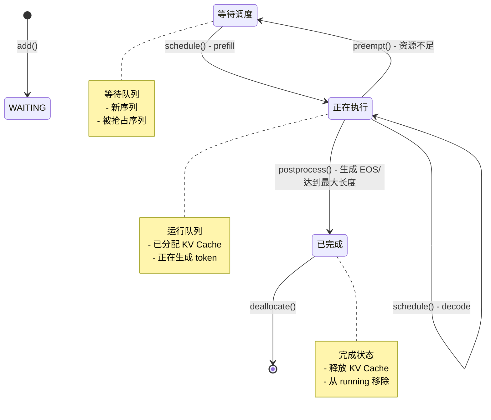
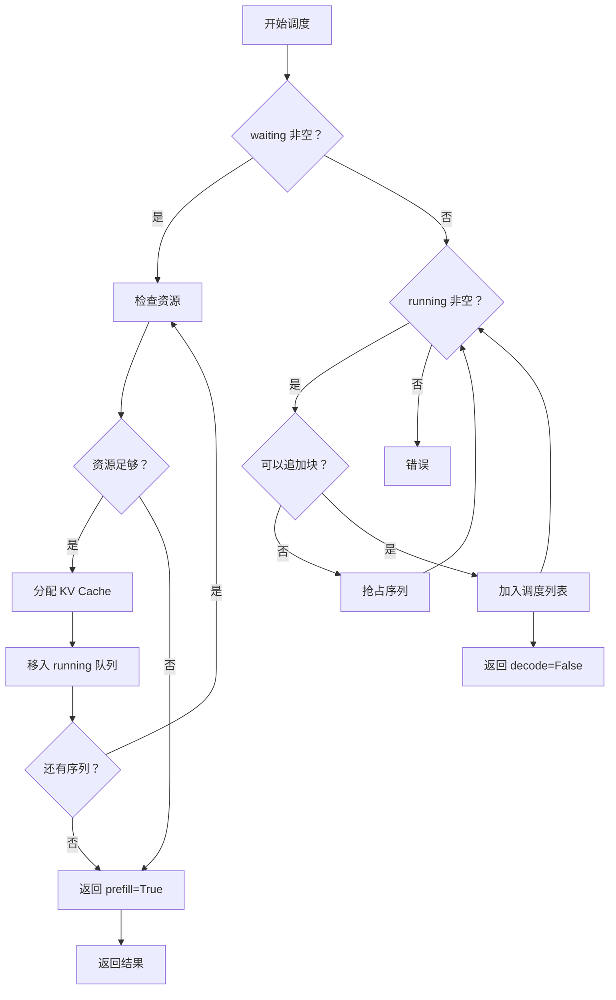
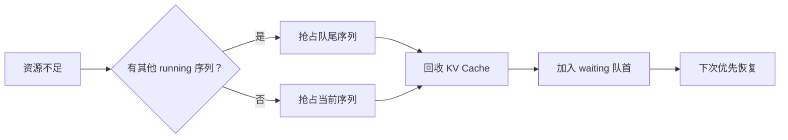
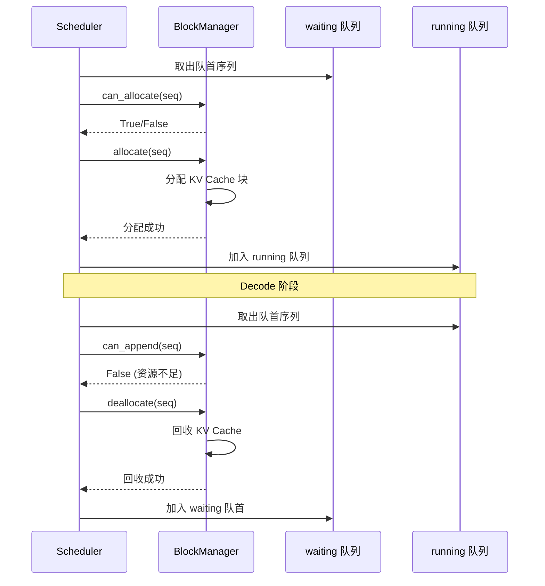

# Scheduler 调度流程详解

## 一、核心职责

`Scheduler` 是 LLM 推理的**调度中枢**，负责：

1. **管理序列生命周期**：WAITING → RUNNING → FINISHED
2. **资源分配决策**：决定哪些序列可以执行
3. **KV Cache 管理**：通过 `BlockManager` 分配/回收内存
4. **抢占式调度**：资源不足时牺牲低优先级序列

---

## 二、数据结构

### 2.1 两个核心队列

```
┌─────────────────────────────────────────────────────────────┐
│                      Scheduler                               │
│                                                              │
│   waiting (FIFO 队列)           running (双端队列)            │
│   ┌───────┐                    ┌───────┐                    │
│   │ Seq A │ ← 新序列加入         │ Seq D │ ← 队首 (优先执行)   │
│   ├───────┤                    ├───────┤                    │
│   │ Seq B │                    │ Seq E │                    │
│   ├───────┤                    ├───────┤                    │
│   │ Seq C │                    │ Seq F │ ← 队尾 (优先抢占)   │
│   └───────┘                    └───────┘                    │
│                                                              │
│   来源：                         来源：                        │
│   - 用户新请求                   - waiting 调度过来           │
│   - 被抢占的序列                 - 正在生成 token             │
└─────────────────────────────────────────────────────────────┘
```

### 2.2 状态机



---

## 三、核心方法详解

### 3.1 `schedule()` - 调度决策

这是调度器的**核心方法**，每轮推理迭代调用一次。

```python
def schedule(self) -> tuple[list[Sequence], bool]:
    """
    Returns:
        (调度的序列列表，是否 prefill 阶段)
    """
```

#### 执行流程



#### 两阶段调度

| 阶段 | 触发条件 | 处理对象 | 资源操作 | 返回值 |
|------|----------|----------|----------|--------|
| **Prefill** | waiting 非空 | 新序列 | 分配 KV Cache 块 | `True` |
| **Decode** | waiting 为空 | 已运行序列 | 可能追加新块 | `False` |

#### 关键逻辑解析

**Prefill 阶段**（第 122-156 行）：
```python
while self.waiting and num_seqs < self.max_num_seqs:
    seq = self.waiting[0]  # 查看队首（不弹出）
    
    # 两个限制条件：
    # 1. token 总数不超过批处理限制
    # 2. BlockManager 有足够空闲块
    if (num_batched_tokens + len(seq) > self.max_num_batched_tokens or
        not self.block_manager.can_allocate(seq)):
        break
    
    # 调度此序列
    self.block_manager.allocate(seq)  # 分配 KV Cache
    num_batched_tokens += len(seq) - seq.num_cached_tokens  # 前缀缓存优化
    seq.status = SequenceStatus.RUNNING
    
    # 队列转移
    self.waiting.popleft()
    self.running.append(seq)
    scheduled_seqs.append(seq)
```

**Decode 阶段**（第 160-183 行）：
```python
while self.running and num_seqs < self.max_num_seqs:
    seq = self.running.popleft()  # 从队首弹出
    
    # 资源不足时抢占
    while not self.block_manager.can_append(seq):
        if self.running:
            self.preempt(self.running.pop())  # 抢占队尾（优先级最低）
        else:
            self.preempt(seq)  # 抢占自己
            break
    else:
        # 资源充足，可以执行
        num_seqs += 1
        self.block_manager.may_append(seq)  # 可能追加新块
        scheduled_seqs.append(seq)

# 保持原顺序放回 running 队列
self.running.extendleft(reversed(scheduled_seqs))
```

---

### 3.2 `preempt()` - 抢占机制

当资源不足时，将序列从 running 移回 waiting：

```python
def preempt(self, seq: Sequence):
    seq.status = SequenceStatus.WAITING
    self.block_manager.deallocate(seq)  # 回收 KV Cache
    self.waiting.appendleft(seq)        # 加入队首（高优先级）
```

#### 抢占策略



#### 抢占优先级

```
running 队列：
┌──────────────────────────────────────┐
│ Seq D │ Seq E │ Seq F │ Seq G │ Seq H │
└──────────────────────────────────────┘
  ↑                                    ↑
  队首 (高优先级)                        队尾 (低优先级，优先被抢占)
```

**设计原因**：
- 队尾序列最近才执行，等待时间最短
- 队首序列等待已久，应优先保证执行

---

### 3.3 `postprocess()` - 后处理

模型生成 token 后调用，处理序列结束条件：

```python
def postprocess(self, seqs: list[Sequence], token_ids: list[int]) -> list[bool]:
    for seq, token_id in zip(seqs, token_ids):
        seq.append_token(token_id)  # 追加 token
        
        # 结束条件：
        # 1. 生成 EOS 且未忽略
        # 2. 达到最大长度
        if ((not seq.ignore_eos and token_id == self.eos) or
            seq.num_completion_tokens == seq.max_tokens):
            seq.status = SequenceStatus.FINISHED
            self.block_manager.deallocate(seq)  # 回收 KV Cache
            self.running.remove(seq)            # 从 running 移除
```

#### 结束条件

| 条件 | 说明 | 示例 |
|------|------|------|
| **EOS token** | 模型生成结束标记 | token_id == eos (如 151643) |
| **达到最大长度** | 生成 token 数达到上限 | num_completion_tokens == max_tokens |

#### 返回值

```python
# 返回每个序列是否完成
# True: 序列已完成 (EOS 或达到最大长度)
# False: 序列继续生成
[False, False, True, False]
```

---

## 四、典型调度场景

### 场景 1：单序列 Prefill → Decode

```
时间线:
T0: 用户请求 "Hello" → add(SeqA)
    waiting: [SeqA]
    running: []

T1: schedule() → Prefill 阶段
    - 分配 KV Cache 块
    - SeqA 从 waiting → running
    返回：([SeqA], True)
    waiting: []
    running: [SeqA]

T2: schedule() → Decode 阶段
    - SeqA 生成第 1 个 token
    返回：([SeqA], False)

T3: schedule() → Decode 阶段
    - SeqA 生成第 2 个 token
    返回：([SeqA], False)

...

Tn: postprocess() 发现 EOS
    - SeqA 状态 → FINISHED
    - 回收 KV Cache
    - 从 running 移除
```

### 场景 2：多序列并发

```
初始状态:
waiting: [SeqA, SeqB, SeqC]
running: []

T1: schedule() → Prefill
    - 调度 SeqA, SeqB (资源限制)
    返回：([SeqA, SeqB], True)
    waiting: [SeqC]
    running: [SeqA, SeqB]

T2: schedule() → Decode
    - SeqA, SeqB 各生成 1 个 token
    返回：([SeqA, SeqB], False)

T3: schedule() → Decode + Prefill
    - SeqA 完成，释放资源
    - SeqC 从 waiting → running (prefill)
    - SeqB 继续 decode
    返回：([SeqC, SeqB], True)  # SeqC 是 prefill
```

### 场景 3：抢占式调度

```
初始状态:
waiting: [SeqA]
running: [SeqB, SeqC, SeqD]  # 资源已用尽

T1: schedule() 尝试调度 SeqA
    - can_allocate(SeqA) → False (资源不足)
    - 进入抢占逻辑:
      * preempt(SeqD)  # 队尾优先级最低
      * SeqD → waiting 队首
    - 重新检查资源: can_allocate(SeqA) → True
    - 调度 SeqA
    返回：([SeqA], True)
    waiting: [SeqD]
    running: [SeqB, SeqC, SeqA]

T2: schedule() → Decode
    - 尝试调度 SeqB
    - can_append(SeqB) → False (资源不足)
    - preempt(SeqC)  # 抢占队尾
    - preempt(SeqB)  # 继续抢占自己
    - 调度 SeqA, SeqD
    返回：([SeqA, SeqD], False)
```

---

## 五、资源限制与约束

### 5.1 三个关键限制

| 限制 | 变量 | 影响阶段 | 说明 |
|------|------|----------|------|
| **最大序列数** | `max_num_seqs` | Prefill & Decode | 同时处理的序列上限 |
| **最大 token 数** | `max_num_batched_tokens` | Prefill | 单次迭代的 token 总量 |
| **KV Cache 块数** | `num_kvcache_blocks` | Prefill & Decode | 可用内存块数量 |

### 5.2 资源检查点

```mermaid
flowchart TD
    A[开始调度] --> B{Prefill 阶段}
    
    B -->|检查 1| C[num_seqs < max_num_seqs?]
    C -->|否 | D[停止调度]
    C -->|是 | E
    
    B -->|检查 2| E[num_batched_tokens + len(seq) <= max?]
    E -->|否 | D
    E -->|是 | F
    
    B -->|检查 3| G[can_allocate(seq)?]
    G -->|否 | D
    G -->|是 | H[调度成功]
    
    D --> I[返回结果]
    H --> I
    
    I --> J{Decode 阶段}
    J -->|检查 | K[can_append(seq)?]
    K -->|否 | L[抢占序列]
    K -->|是 | M[调度成功]
    L --> K
    M --> I
```

---

## 六、与 BlockManager 的协作

### 6.1 调用关系



### 6.2 KV Cache 生命周期

```
序列生命周期          BlockManager 状态
────────────          ─────────────────
[WAITING]    ─────►   未分配块
   │
   │ allocate()
   ▼
[RUNNING]    ─────►   已分配块 (ref_count >= 1)
   │
   │ may_append()
   ▼
[RUNNING]    ─────►   可能追加新块
   │
   │ deallocate() (抢占)
   ▼
[WAITING]    ─────►   块 ref_count 减 1 (可能仍被共享)
   │
   │ allocate() (恢复)
   ▼
[RUNNING]    ─────►   重新分配或复用块
   │
   │ deallocate() (完成)
   ▼
[FINISHED]   ─────►   块 ref_count 降为 0 时回收
```

---

## 七、关键设计决策

### 7.1 为什么 Prefill 优先？

**原因**：
1. **公平性**：新请求应尽快得到响应
2. **吞吐量**：Prefill 一次性处理所有输入 token，效率高
3. **用户体验**：减少新请求的等待时间

**代价**：
- 可能导致 running 队列中的序列饥饿
- 通过抢占机制缓解

### 7.2 为什么抢占队尾序列？

**原因**：
1. **等待时间**：队尾序列最近才执行，等待时间最短
2. **进度保护**：队首序列等待已久，应优先保证
3. **简单高效**：O(1) 时间复杂度

### 7.3 为什么使用双端队列？

**running 队列使用双端队列的原因**：
1. **队首弹出**：FIFO 顺序执行
2. **队尾弹出**：抢占优先级最低的序列
3. **队首插入**：extendleft 保持顺序

---

## 八、性能优化点

### 8.1 前缀缓存优化

```python
# Prefill 阶段
num_batched_tokens += len(seq) - seq.num_cached_tokens
```

- `seq.num_cached_tokens`：前缀缓存命中的 token 数
- 只计算未命中的 token，减少计算量

### 8.2 批处理优化

```python
# 一次调度多个序列
while self.waiting and num_seqs < self.max_num_seqs:
    ...
```

- 充分利用 GPU 并行能力
- 通过 `max_num_batched_tokens` 控制批大小

### 8.3 抢占优化

```python
# 抢占队尾，保护队首
if self.running:
    self.preempt(self.running.pop())
```

- 最小化抢占对进度的影响
- 被抢占序列加入队首，优先恢复

---

## 九、调试技巧

### 9.1 打印调度状态

```python
def schedule(self):
    print(f"调度前：waiting={len(self.waiting)}, running={len(self.running)}")
    ...
    print(f"调度后：scheduled={len(scheduled_seqs)}, is_prefill={is_prefill}")
```

### 9.2 检查资源使用

```python
# 检查 KV Cache 使用情况
used_blocks = len(self.block_manager.used_block_ids)
total_blocks = len(self.block_manager.blocks)
print(f"KV Cache 使用率：{used_blocks/total_blocks:.2%}")
```

### 9.3 追踪序列状态

```python
for seq in self.waiting + self.running:
    print(f"Seq {seq.seq_id}: status={seq.status}, "
          f"len={len(seq)}, cached={seq.num_cached_tokens}")
```

---

## 十、总结

### Scheduler 核心逻辑总结

| 组件 | 职责 | 关键方法 |
|------|------|----------|
| **waiting 队列** | 存储待调度序列 | `add()`, `preempt()` |
| **running 队列** | 存储正在执行的序列 | `schedule()`, `postprocess()` |
| **Prefill 调度** | 新序列首次执行 | `allocate()`, `can_allocate()` |
| **Decode 调度** | 已运行序列继续生成 | `may_append()`, `can_append()` |
| **抢占机制** | 资源不足时牺牲低优先级 | `preempt()`, `deallocate()` |

### 调度流程图

```mermaid
flowchart TB
    subgraph 用户请求
        U[用户调用 generate]
    end
    
    subgraph Scheduler
        W[waiting 队列]
        R[running 队列]
        S[schedule]
        P[postprocess]
    end
    
    subgraph BlockManager
        BM[分配/回收 KV Cache]
    end
    
    subgraph ModelRunner
        MR[执行模型]
    end
    
    U -->|add()| W
    W -->|schedule()| S
    S -->|allocate()| BM
    S -->|返回序列 | MR
    MR -->|token_ids| P
    P -->|FINISHED| BM
    P -->|继续 | R
    R -->|schedule()| S
```

</content>