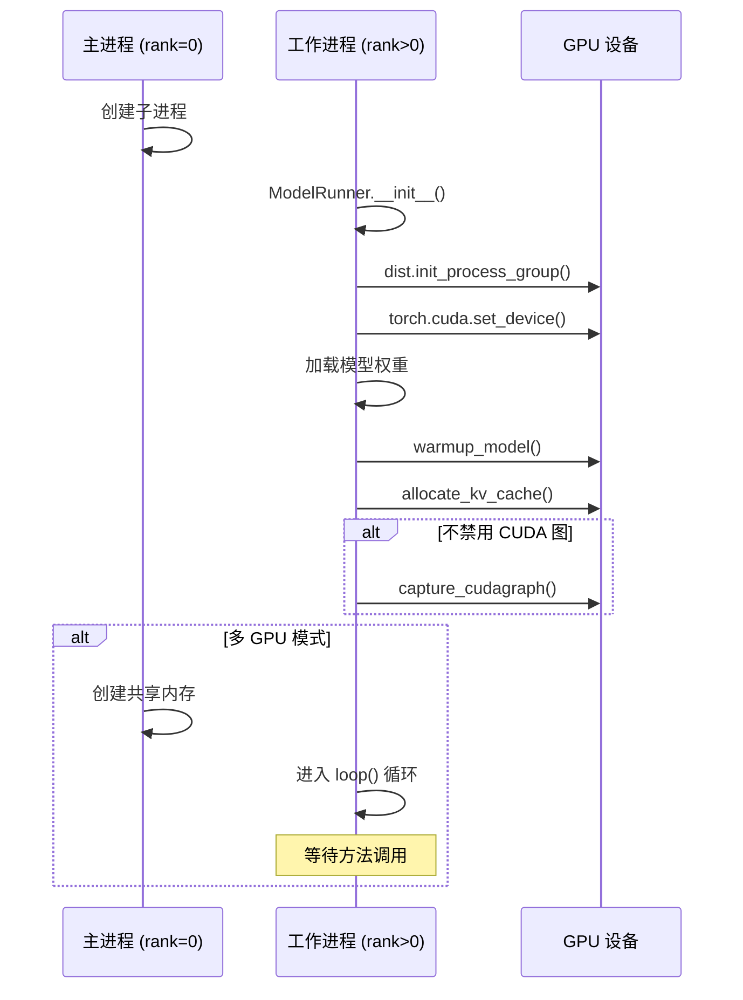

# ModelRunner 模型执行器详解

## 一、模块概述

`ModelRunner` 是 Nano-vLLM 中负责模型加载和实际计算的核心组件。每个 GPU 对应一个 `ModelRunner` 实例，通过多进程方式并行执行。

### 1.1 核心职责

| 职责 | 说明 |
|------|------|
| **模型加载** | 加载 HuggingFace 模型权重 |
| **KV Cache 分配** | 根据 GPU 内存动态分配 KV Cache |
| **模型执行** | 执行 Prefill 和 Decode 阶段的前向传播 |
| **CUDA 图捕获** | 为 Decode 阶段捕获 CUDA 图以加速推理 |
| **多进程通信** | 通过共享内存和 NCCL 进行进程间通信 |

### 1.2 在架构中的位置

```
┌─────────────────────────────────────────────────────────────┐
│                      LLMEngine                               │
│  ┌─────────────────────────────────────────────────────────┐│
│  │                   Scheduler                              ││
│  └─────────────────────────────────────────────────────────┘│
│                              │                               │
│                              ▼                               │
│  ┌─────────────────────────────────────────────────────────┐│
│  │                  ModelRunner                            ││
│  │  ┌─────────────┐  ┌─────────────┐  ┌─────────────┐     ││
│  │  │  rank=0     │  │  rank=1     │  │  rank=N     │     ││
│  │  │  (主进程)   │  │  (工作进程)  │  │  (工作进程)  │     ││
│  │  └─────────────┘  └─────────────┘  └─────────────┘     ││
│  └─────────────────────────────────────────────────────────┘│
└─────────────────────────────────────────────────────────────┘
```

### 1.3 多进程架构

```
进程间通信机制:
─────────────────────────────────────────────────────────┐

┌─────────────────┐         共享内存          ┌─────────────────┐
│   ModelRunner   │ ←─── pickle([method,    │   ModelRunner   │
│     rank=0      │ ←────── args]) ─────────→│     rank=1      │
│   (主进程)      │ ←────── Event 同步 ──────→│   (工作进程)    │
└────────┬────────┘ ←────── NCCL 分布式 ──────→└────────┬────────┘
         │                                              │
         │              GPU 0                           │  GPU 1
         └──────────────────────────────────────────────┘
```

---

## 二、初始化流程

### 2.1 初始化步骤

```python
class ModelRunner:
    def __init__(self, config: Config, rank: int, event: Event | list[Event]):
        # 1. 保存配置
        self.config = config
        self.rank = rank
        self.world_size = config.tensor_parallel_size
        
        # 2. 初始化分布式进程组
        dist.init_process_group("nccl", "tcp://localhost:2333", 
                               world_size=self.world_size, rank=rank)
        torch.cuda.set_device(rank)
        
        # 3. 加载模型
        self.model = Qwen3ForCausalLM(hf_config)
        load_model(self.model, config.model)
        
        # 4. 模型预热
        self.warmup_model()
        
        # 5. 分配 KV Cache
        self.allocate_kv_cache()
        
        # 6. 捕获 CUDA 图（可选）
        if not self.enforce_eager:
            self.capture_cudagraph()
        
        # 7. 多进程设置
        if self.world_size > 1:
            if rank == 0:
                self.shm = SharedMemory(name="nanovllm", create=True, size=2**20)
            else:
                self.loop()  # rank>0 进入循环等待
```

### 2.2 初始化时序图



---

## 三、核心方法详解

### 3.1 模型预热 (`warmup_model`)

**目的**：
- 初始化 CUDA 上下文
- 触发 Lazy Initialization
- 预分配内存
- 验证模型正确性

```python
def warmup_model(self):
    torch.cuda.empty_cache()
    torch.cuda.reset_peak_memory_stats()
    
    # 使用最大可能的输入尺寸进行预热
    max_num_batched_tokens = self.config.max_num_batched_tokens
    max_model_len = self.config.max_model_len
    num_seqs = min(max_num_batched_tokens // max_model_len, self.config.max_num_seqs)
    
    # 创建满长度的虚拟序列
    seqs = [Sequence([0] * max_model_len) for _ in range(num_seqs)]
    self.run(seqs, True)  # 执行 prefill 模式
    
    torch.cuda.empty_cache()
```

**为什么使用最大尺寸？**
```
预热使用最大模型长度和最大批处理大小：
- 确保后续推理不会遇到未初始化的路径
- 让 PyTorch 预分配足够大的内存池
- 避免推理过程中动态分配内存的开销
```

---

### 3.2 KV Cache 分配 (`allocate_kv_cache`)

**目的**：根据 GPU 可用内存动态计算并分配 KV Cache。

```python
def allocate_kv_cache(self):
    config = self.config
    hf_config = config.hf_config
    
    # 1. 获取 GPU 内存信息
    free, total = torch.cuda.mem_get_info()
    used = total - free
    peak = torch.cuda.memory_stats()["allocated_bytes.all.peak"]
    current = torch.cuda.memory_stats()["allocated_bytes.all.current"]
    
    # 2. 计算每个 KV Cache 块的大小（字节）
    num_kv_heads = hf_config.num_key_value_heads // self.world_size
    head_dim = getattr(hf_config, "head_dim", 
                      hf_config.hidden_size // hf_config.num_attention_heads)
    block_bytes = (2 * hf_config.num_hidden_layers * self.block_size * 
                   num_kv_heads * head_dim * hf_config.torch_dtype.itemsize)
    
    # 3. 计算可分配的块数量
    # 公式：(目标内存 - 已用内存 - 峰值 + 当前) / 块大小
    config.num_kvcache_blocks = (
        int(total * config.gpu_memory_utilization - used - peak + current) 
        // block_bytes
    )
    
    # 4. 分配 KV Cache 张量
    self.kv_cache = torch.empty(
        2,  # key 和 value
        hf_config.num_hidden_layers,
        config.num_kvcache_blocks,
        self.block_size,
        num_kv_heads,
        head_dim
    )
    
    # 5. 绑定到模型的注意力层
    layer_id = 0
    for module in self.model.modules():
        if hasattr(module, "k_cache") and hasattr(module, "v_cache"):
            module.k_cache = self.kv_cache[0, layer_id]
            module.v_cache = self.kv_cache[1, layer_id]
            layer_id += 1
```

**内存计算公式**：
```
可用内存 = total * gpu_memory_utilization - used - peak + current

其中：
- total * gpu_memory_utilization: 目标使用的总内存
- used: 模型权重已占用的内存
- peak - current: 临时分配已释放的内存

这样可以在保留模型权重的同时最大化 KV Cache 容量。
```

---

### 3.3 CUDA 图捕获 (`capture_cudagraph`)

**目的**：为 Decode 阶段捕获 CUDA 图，减少 CPU 调度开销。

```python
@torch.inference_mode()
def capture_cudagraph(self):
    max_bs = min(self.config.max_num_seqs, 512)
    max_num_blocks = (config.max_model_len + self.block_size - 1) // self.block_size
    
    # 1. 预分配最大尺寸的张量
    input_ids = torch.zeros(max_bs, dtype=torch.int64)
    positions = torch.zeros(max_bs, dtype=torch.int64)
    slot_mapping = torch.zeros(max_bs, dtype=torch.int32)
    context_lens = torch.zeros(max_bs, dtype=torch.int32)
    block_tables = torch.zeros(max_bs, max_num_blocks, dtype=torch.int32)
    outputs = torch.zeros(max_bs, hf_config.hidden_size)
    
    # 2. 定义要捕获的 batch size 序列
    self.graph_bs = [1, 2, 4, 8] + list(range(16, max_bs + 1, 16))
    self.graphs = {}
    self.graph_pool = None
    
    # 3. 从大到小捕获图（有利于内存优化）
    for bs in reversed(self.graph_bs):
        graph = torch.cuda.CUDAGraph()
        
        # 设置上下文
        set_context(False, 
                   slot_mapping=slot_mapping[:bs], 
                   context_lens=context_lens[:bs], 
                   block_tables=block_tables[:bs])
        
        # 预热
        outputs[:bs] = self.model(input_ids[:bs], positions[:bs])
        
        # 捕获 CUDA 图
        with torch.cuda.graph(graph, self.graph_pool):
            outputs[:bs] = self.model(input_ids[:bs], positions[:bs])
        
        # 保存图池
        if self.graph_pool is None:
            self.graph_pool = graph.pool()
        
        self.graphs[bs] = graph
        torch.cuda.synchronize()
        reset_context()
    
    # 4. 保存图变量，用于运行时更新
    self.graph_vars = dict(
        input_ids=input_ids,
        positions=positions,
        slot_mapping=slot_mapping,
        context_lens=context_lens,
        block_tables=block_tables,
        outputs=outputs,
    )
```

**为什么从大到小捕获？**
```
从大到小捕获 CUDA 图有利于内存优化：
- 第一个捕获的图（最大 batch size）创建内存池
- 后续图复用该内存池
- 避免内存碎片化
```

---

### 3.4 数据准备方法

#### Prefill 数据准备 (`prepare_prefill`)

```python
def prepare_prefill(self, seqs: list[Sequence]):
    """
    准备 Prefill 阶段的输入数据
    
    Prefill 阶段处理整个 prompt，需要：
    - 输入 token IDs（未缓存的部分）
    - 位置信息
    - 累积序列长度（用于 Flash Attention）
    - slot_mapping（KV Cache 槽位映射）
    """
    input_ids = []
    positions = []
    cu_seqlens_q = [0]  # query 的累积序列长度
    cu_seqlens_k = [0]  # key 的累积序列长度
    slot_mapping = []   # KV Cache 槽位映射
    
    for seq in seqs:
        seqlen = len(seq)
        # 只添加未缓存的 token（跳过 prefix cache 已缓存的部分）
        input_ids.extend(seq[seq.num_cached_tokens:])
        positions.extend(list(range(seq.num_cached_tokens, seqlen)))
        
        seqlen_q = seqlen - seq.num_cached_tokens  # 本次需要处理的 token 数
        seqlen_k = seqlen  # 完整的序列长度（用于 KV Cache 查找）
        
        cu_seqlens_q.append(cu_seqlens_q[-1] + seqlen_q)
        cu_seqlens_k.append(cu_seqlens_k[-1] + seqlen_k)
        
        # 构建 slot_mapping：将 token 位置映射到 KV Cache 的物理槽位
        for i in range(seq.num_cached_blocks, seq.num_blocks):
            start = seq.block_table[i] * self.block_size
            end = start + (self.block_size if i != seq.num_blocks - 1 
                          else seq.last_block_num_tokens)
            slot_mapping.extend(list(range(start, end)))
    
    # 转换为 CUDA 张量
    input_ids = torch.tensor(input_ids, dtype=torch.int64).cuda()
    positions = torch.tensor(positions, dtype=torch.int64).cuda()
    cu_seqlens_q = torch.tensor(cu_seqlens_q, dtype=torch.int32).cuda()
    cu_seqlens_k = torch.tensor(cu_seqlens_k, dtype=torch.int32).cuda()
    slot_mapping = torch.tensor(slot_mapping, dtype=torch.int32).cuda()
    
    # 设置上下文（供注意力层使用）
    set_context(True, cu_seqlens_q, cu_seqlens_k, 
               max_seqlen_q, max_seqlen_k, slot_mapping)
    
    return input_ids, positions
```

#### Decode 数据准备 (`prepare_decode`)

```python
def prepare_decode(self, seqs: list[Sequence]):
    """
    准备 Decode 阶段的输入数据
    
    Decode 阶段每次只生成一个 token，需要：
    - 最后一个 token 的 ID
    - 位置信息（序列长度 - 1）
    - slot_mapping（最后一个 KV Cache 槽位）
    - context_lens（上下文长度）
    - block_tables（块表）
    """
    input_ids = []
    positions = []
    slot_mapping = []
    context_lens = []
    
    for seq in seqs:
        input_ids.append(seq.last_token)
        positions.append(len(seq) - 1)
        context_lens.append(len(seq))
        slot_mapping.append(
            seq.block_table[-1] * self.block_size + seq.last_block_num_tokens - 1
        )
    
    # 转换为 CUDA 张量
    input_ids = torch.tensor(input_ids, dtype=torch.int64).cuda()
    positions = torch.tensor(positions, dtype=torch.int64).cuda()
    slot_mapping = torch.tensor(slot_mapping, dtype=torch.int32).cuda()
    context_lens = torch.tensor(context_lens, dtype=torch.int32).cuda()
    block_tables = self.prepare_block_tables(seqs)
    
    # 设置上下文（Decode 模式）
    set_context(False, slot_mapping=slot_mapping, 
               context_lens=context_lens, block_tables=block_tables)
    
    return input_ids, positions
```

---

### 3.5 模型执行 (`run_model`)

```python
@torch.inference_mode()
def run_model(self, input_ids, positions, is_prefill):
    """
    执行模型前向传播
    
    Prefill 阶段或 eager 模式下直接执行模型。
    Decode 阶段且启用 CUDA 图时使用图执行以加速。
    """
    if is_prefill or self.enforce_eager or input_ids.size(0) > 512:
        # 直接执行
        return self.model.compute_logits(self.model(input_ids, positions))
    else:
        # 使用 CUDA 图加速 Decode 阶段
        bs = input_ids.size(0)
        context = get_context()
        
        # 选择能容纳当前 batch size 的最小图
        graph = self.graphs[next(x for x in self.graph_bs if x >= bs)]
        graph_vars = self.graph_vars
        
        # 更新图变量
        graph_vars["input_ids"][:bs] = input_ids
        graph_vars["positions"][:bs] = positions
        graph_vars["slot_mapping"][:bs] = context.slot_mapping
        graph_vars["context_lens"][:bs] = context.context_lens
        graph_vars["block_tables"][:bs] = context.block_tables
        
        # 重放 CUDA 图
        graph.replay()
        
        return self.model.compute_logits(graph_vars["outputs"][:bs])
```

---

### 3.6 完整执行流程 (`run`)

```python
def run(self, seqs: list[Sequence], is_prefill: bool) -> list[int]:
    """
    执行一次推理步骤
    
    Args:
        seqs: 序列列表
        is_prefill: 是否为 Prefill 阶段
        
    Returns:
        token_ids: 生成的 token IDs（仅 rank=0 返回有效值）
    """
    # 1. 准备输入数据
    input_ids, positions = (
        self.prepare_prefill(seqs) if is_prefill 
        else self.prepare_decode(seqs)
    )
    
    # 2. 准备采样参数（仅 rank=0 需要）
    temperatures = self.prepare_sample(seqs) if self.rank == 0 else None
    
    # 3. 执行模型
    logits = self.run_model(input_ids, positions, is_prefill)
    
    # 4. 采样生成 token
    token_ids = self.sampler(logits, temperatures).tolist() if self.rank == 0 else None
    
    # 5. 重置上下文
    reset_context()
    
    return token_ids
```

---

## 四、多进程通信

### 4.1 共享内存通信

```python
def write_shm(self, method_name, *args):
    """rank=0 向共享内存写入方法调用信息"""
    data = pickle.dumps([method_name, *args])
    n = len(data)
    self.shm.buf[0:4] = n.to_bytes(4, "little")  # 写入长度
    self.shm.buf[4:n+4] = data                   # 写入数据
    for event in self.event:
        event.set()  # 触发所有 rank>0 的事件

def read_shm(self):
    """rank>0 从共享内存读取方法调用信息"""
    self.event.wait()  # 等待事件触发
    n = int.from_bytes(self.shm.buf[0:4], "little")  # 读取长度
    method_name, *args = pickle.loads(self.shm.buf[4:n+4])
    self.event.clear()
    return method_name, args
```

### 4.2 事件同步

```
事件同步流程:
─────────────────────────────────────────────────────────┐

rank=0 (主进程)              rank>0 (工作进程)
─────────────────           ─────────────────
调用方法                     在 loop() 中等待
  │                           │
  ├─ write_shm()              │
  │  写入数据                  │
  │  触发事件 ────────────────┼─> event.wait() 返回
  │                           │  读取数据
  │                           │  执行方法
  │                           │
  │<──────────────────────────┼─  执行完成
  │                           │  等待下一次事件
```

---

## 五、典型使用场景

### 场景 1：单 GPU 推理

```python
# 初始化
config = Config(model="/path/to/model", tensor_parallel_size=1)
runner = ModelRunner(config, rank=0, event=None)

# 执行推理
seqs = [Sequence([1, 2, 3, 4, 5])]
token_ids = runner.run(seqs, is_prefill=True)
```

---

### 场景 2：多 GPU 张量并行

```python
# 主进程 (rank=0)
config = Config(model="/path/to/model", tensor_parallel_size=4)
events = [Event() for _ in range(3)]

# 创建工作进程
for i in range(1, 4):
    process = Process(target=ModelRunner, args=(config, i, events[i-1]))
    process.start()

# 主进程初始化
runner = ModelRunner(config, rank=0, events)

# 调用方法（自动同步到所有工作进程）
runner.call("run", seqs, True)
```

---

## 六、性能优化技巧

### 6.1 CUDA 图优化

```
使用 CUDA 图的条件：
1. 非 eager 模式（enforce_eager=False）
2. Decode 阶段
3. batch size ≤ 512

收益：
- 减少 CPU 调度开销
- 提高 Decode 阶段吞吐量
```

### 6.2 内存优化

```python
# 动态计算 KV Cache 大小
num_kvcache_blocks = (可用内存) // block_bytes

# 避免内存碎片
# - 从大到小捕获 CUDA 图
# - 使用内存池
```

### 6.3 通信优化

```python
# 使用共享内存而不是 pickle 传输大张量
# - 方法名和参数通过共享内存传递
# - 张量数据通过 NCCL 直接通信
```

---

## 七、调试技巧

### 7.1 打印内存使用

```python
def allocate_kv_cache(self):
    free, total = torch.cuda.mem_get_info()
    print(f"GPU {self.rank}: 可用内存={free/1e9:.2f}GB, 总内存={total/1e9:.2f}GB")
    print(f"分配 {num_kvcache_blocks} 个 KV Cache 块")
```

### 7.2 追踪方法调用

```python
def call(self, method_name, *args):
    print(f"rank={self.rank}: 调用 {method_name}")
    return getattr(self, method_name)(*args)
```

---

## 八、总结

### ModelRunner 核心职责

| 职责 | 说明 |
|------|------|
| **模型加载** | 加载 HuggingFace 权重 |
| **KV Cache 管理** | 动态分配和管理 KV Cache |
| **模型执行** | Prefill 和 Decode 前向传播 |
| **CUDA 图** | 捕获和重放 CUDA 图 |
| **多进程通信** | 共享内存 + NCCL |

### 关键设计决策

| 决策 | 原因 |
|------|------|
| 多进程架构 | 支持张量并行 |
| 共享内存通信 | 高效的进程间通信 |
| CUDA 图捕获 | 减少 Decode 开销 |
| 动态内存分配 | 适配不同 GPU |
