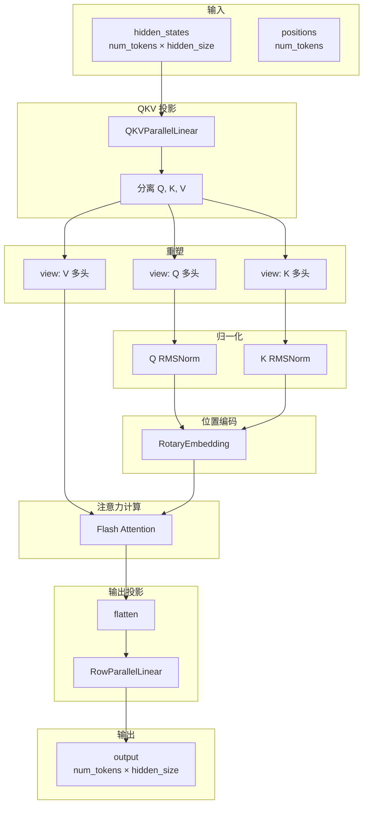
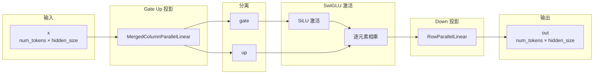
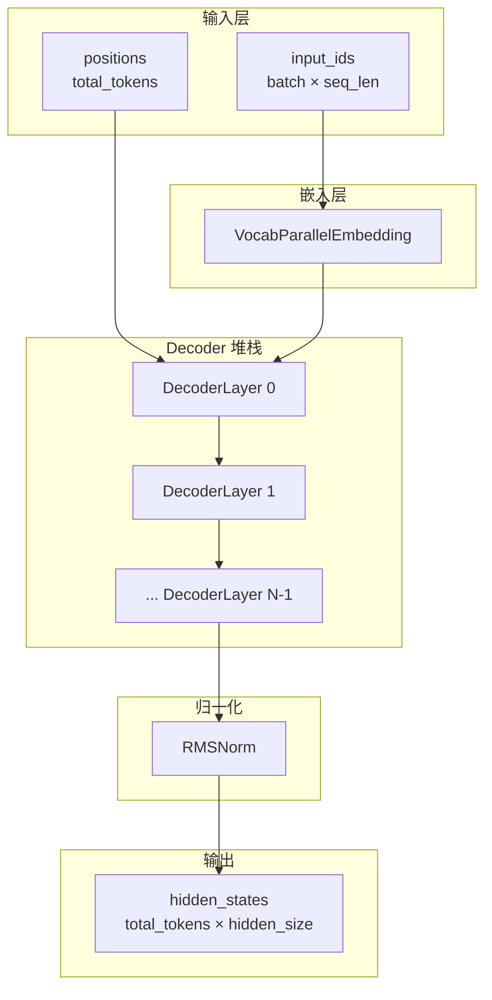
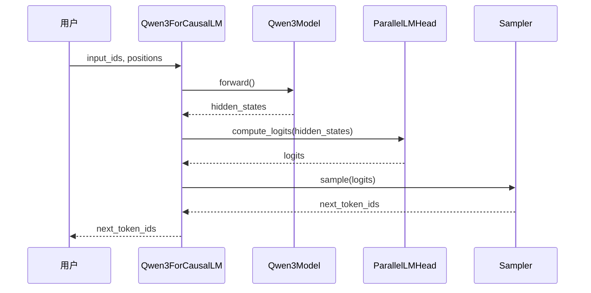

# Qwen3 模型架构详解

## 一、概述

### 1.1 模型简介

Qwen3 是基于 Transformer Decoder-only 架构的大语言模型，具有以下核心特点：

- **Decoder-only Transformer**：自回归生成架构
- **RoPE 旋转位置编码**：更好的位置信息表示
- **SwiGLU 激活函数**：MLP 层使用门控线性单元
- **RMSNorm 归一化**：更高效的层归一化
- **GQA（Grouped Query Attention）**：平衡性能与效率
- **张量并行支持**：多 GPU 推理加速

### 1.2 模型层级结构

```
Qwen3ForCausalLM (完整语言模型)
│
├── Qwen3Model (基础模型)
│   │
│   ├── VocabParallelEmbedding (词嵌入层)
│   │
│   ├── Qwen3DecoderLayer × N (Decoder 层堆栈)
│   │   │
│   │   ├── Qwen3Attention (自注意力层)
│   │   │   ├── QKVParallelLinear (QKV 联合投影)
│   │   │   ├── RowParallelLinear (输出投影)
│   │   │   ├── RotaryEmbedding (RoPE 位置编码)
│   │   │   └── Attention (Flash Attention)
│   │   │
│   │   ├── Qwen3MLP (前馈神经网络)
│   │   │   ├── MergedColumnParallelLinear (gate_up 投影)
│   │   │   ├── RowParallelLinear (down 投影)
│   │   │   └── SiluAndMul (SwiGLU 激活)
│   │   │
│   │   ├── RMSNorm (input_layernorm)
│   │   └── RMSNorm (post_attention_layernorm)
│   │
│   └── RMSNorm (final_norm - 最终归一化)
│
└── ParallelLMHead (语言模型输出头)
```

### 1.3 数据流图

```mermaid
flowchart LR
    subgraph 输入
        Input[input_ids 位置]
    end
    
    subgraph 嵌入层
        Embed[词嵌入查找]
    end
    
    subgraph Decoder 层 1
        Attn1[自注意力]
        MLP1[MLP]
        Norm1_1[RMSNorm]
        Norm1_2[RMSNorm]
    end
    
    subgraph Decoder 层 N
        AttnN[自注意力]
        MLPN[MLP]
        NormN_1[RMSNorm]
        NormN_2[RMSNorm]
    end
    
    subgraph 输出
        FinalNorm[最终归一化]
        LMHead[LM Head]
        Logits[logits]
    end
    
    Input --> Embed
    Embed --> Norm1_1
    Norm1_1 --> Attn1
    Attn1 --> Norm1_2
    Norm1_2 --> MLP1
    MLP1 --> Decoder 层 N
    AttnN --> NormN_2
    NormN_2 --> MLPN
    MLPN --> FinalNorm
    FinalNorm --> LMHead
    LMHead --> Logits
```

---

## 二、核心组件详解

### 2.1 Qwen3Attention（自注意力层）

#### 结构图



#### GQA（Grouped Query Attention）配置

```
标准 MHA (Multi-Head Attention):
┌─────────────────────────────────┐
│ Q: 32 heads                     │
│ K: 32 heads                     │
│ V: 32 heads                     │
└─────────────────────────────────┘

GQA (Grouped Query Attention):
┌─────────────────────────────────┐
│ Q: 32 heads                     │
│ K: 8 heads  (每组 4 个 Q 共享 1 个 K) │
│ V: 8 heads  (每组 4 个 Q 共享 1 个 V) │
└─────────────────────────────────┘

MQA (Multi-Query Attention):
┌─────────────────────────────────┐
│ Q: 32 heads                     │
│ K: 1 head   (所有 Q 共享 1 个 K)    │
│ V: 1 head   (所有 Q 共享 1 个 V)    │
└─────────────────────────────────┘
```

#### 关键参数

| 参数 | 说明 | 计算方式 |
|------|------|----------|
| `total_num_heads` | 总注意力头数 | 来自 config |
| `num_heads` | 单 GPU 头数 | `total_num_heads // tp_size` |
| `total_num_kv_heads` | 总 KV 头数 | 来自 config |
| `num_kv_heads` | 单 GPU KV 头数 | `total_num_kv_heads // tp_size` |
| `head_dim` | 每头维度 | `hidden_size // total_num_heads` |
| `q_size` | Q 投影输出维度 | `num_heads × head_dim` |
| `kv_size` | K/V 投影输出维度 | `num_kv_heads × head_dim` |
| `scaling` | 注意力缩放因子 | `head_dim ** -0.5` |

#### 前向传播流程

```python
# 1. QKV 联合投影
# [num_tokens, hidden_size] → [num_tokens, (num_heads + 2*num_kv_heads) * head_dim]
qkv = self.qkv_proj(hidden_states)

# 2. 分离 Q, K, V
q, k, v = qkv.split([self.q_size, self.kv_size, self.kv_size], dim=-1)

# 3. 重塑为多头格式
# [num_tokens, num_heads, head_dim]
q = q.view(-1, self.num_heads, self.head_dim)
k = k.view(-1, self.num_kv_heads, self.head_dim)
v = v.view(-1, self.num_kv_heads, self.head_dim)

# 4. Q/K 归一化（如果 QKV 投影没有偏置）
q = self.q_norm(q)
k = self.k_norm(k)

# 5. RoPE 位置编码
q, k = self.rotary_emb(positions, q, k)

# 6. Flash Attention 计算
o = self.attn(q, k, v)

# 7. 输出投影
output = self.o_proj(o.flatten(1, -1))
```

---

### 2.2 Qwen3MLP（前馈神经网络）

#### 结构图



#### SwiGLU 激活函数

```
SwiGLU(gate, up) = SiLU(gate) × up

其中 SiLU(x) = x × σ(x)  (Sigmoid Linear Unit)

优势：
1. 门控机制：gate 控制信息流动
2. 非线性：比 ReLU 更强的表达能力
3. 平滑梯度：更好的训练稳定性
```

#### 权重合并

```python
# HuggingFace 原始权重（分开存储）
gate_proj.weight: [intermediate_size, hidden_size]
up_proj.weight:   [intermediate_size, hidden_size]

# Nano-vLLM 合并权重（减少 kernel 启动开销）
gate_up_proj.weight: [2 * intermediate_size, hidden_size]
                     └─────┬─────┘└─────┬─────┘
                      gate 部分    up 部分
```

---

### 2.3 Qwen3DecoderLayer（Decoder 层）

#### Pre-Norm 架构

```
输入 (hidden_states, residual)
         │
         ▼
    ┌─────────────┐
    │ input_norm  │ RMSNorm
    └──────┬──────┘
         │
         ▼
    ┌─────────────┐
    │ self_attn   │ 自注意力
    └──────┬──────┘
         │
         ▼
    ┌─────────────┐
    │post_attn_norm│ RMSNorm + 残差融合
    └──────┬──────┘
         │
         ▼
    ┌─────────────┐
    │     mlp     │ MLP 层
    └──────┬──────┘
         │
         ▼
输出 (new_hidden_states, new_residual)
```

#### 残差连接流程

```python
# 第一层：初始化残差
hidden_states, residual = input_layernorm(hidden_states), hidden_states
hidden_states = self_attn(positions, hidden_states)

# MLP 块：融合残差
hidden_states, residual = post_attention_layernorm(hidden_states, residual)
hidden_states = mlp(hidden_states)

# 返回：(hidden_states, residual)
# 下一层会将 residual 与新的 hidden_states 融合
```

#### 残差融合优化

```
传统残差连接：
    hidden = norm(input)
    hidden = attn(hidden)
    hidden = hidden + input  # 单独加法

Nano-vLLM 优化：
    hidden, residual = norm(input), input
    hidden = attn(hidden)
    hidden, residual = norm(hidden, residual)  # 融合加法和归一化
    hidden = mlp(hidden)
```

---

### 2.4 Qwen3Model（基础模型）

#### 整体结构



#### 层间数据流

```python
# 1. 词嵌入查找
hidden_states = embed_tokens(input_ids)  # [batch, seq_len, hidden_size]

# 2. 逐层处理
residual = None
for layer in layers:
    hidden_states, residual = layer(positions, hidden_states, residual)
    # 每层输出：(新的 hidden_states, 新的 residual)

# 3. 最终归一化（融合残差）
hidden_states, _ = norm(hidden_states, residual)
```

---

### 2.5 Qwen3ForCausalLM（完整模型）

#### 推理流程



#### 权重打包映射

```python
packed_modules_mapping = {
    # QKV 联合投影的权重映射
    "q_proj": ("qkv_proj", "q"),      # q_proj → qkv_proj 的 q 部分
    "k_proj": ("qkv_proj", "k"),      # k_proj → qkv_proj 的 k 部分
    "v_proj": ("qkv_proj", "v"),      # v_proj → qkv_proj 的 v 部分
    
    # Gate-Up 联合投影的权重映射
    "gate_proj": ("gate_up_proj", 0), # gate_proj → gate_up_proj 的第 0 块
    "up_proj": ("gate_up_proj", 1),   # up_proj → gate_up_proj 的第 1 块
}
```

#### 权重加载流程

```
HuggingFace 权重文件：
├── q_proj.weight
├── k_proj.weight
├── v_proj.weight
├── gate_proj.weight
├── up_proj.weight
└── ...

Nano-vLLM 加载后：
├── qkv_proj.weight (合并 q, k, v)
├── gate_up_proj.weight (合并 gate, up)
└── ...

优势：
1. 减少内存碎片
2. 减少 kernel 启动次数
3. 提高矩阵乘法效率
```

---

## 三、张量并行支持

### 3.1 并行策略

```
张量并行 (Tensor Parallelism):
- 将模型权重切分到多个 GPU
- 每个 GPU 计算一部分
- 通过 NCCL 通信聚合结果

切分维度：
1. 词汇表并行：词嵌入层和 LM Head
2. 注意力头并行：QKV 投影和输出投影
3. MLP 并行：gate_up_proj 和 down_proj
```

### 3.2 各层并行方式

| 层 | 并行方式 | 切分维度 |
|------|----------|----------|
| `VocabParallelEmbedding` | 词汇表并行 | `vocab_size // tp_size` |
| `QKVParallelLinear` | 注意力头并行 | `num_heads // tp_size` |
| `RowParallelLinear` (o_proj) | 输入维度并行 | `hidden_size` 不变，输出聚合 |
| `MergedColumnParallelLinear` | 中间维度并行 | `intermediate_size // tp_size` |
| `ParallelLMHead` | 词汇表并行 | `vocab_size // tp_size` |

### 3.3 通信模式

```
QKV 投影后的 AllReduce:
GPU0: Q0, K0, V0 ─┐
GPU1: Q1, K1, V1 ─┼── AllGather ──► 完整 Q, K, V
GPU2: Q2, K2, V2 ─┤
GPU3: Q3, K3, V3 ─┘

MLP 后的 AllReduce:
GPU0: partial_0 ─┐
GPU1: partial_1 ─┼── AllReduce ──► 完整 output
GPU2: partial_2 ─┤
GPU3: partial_3 ─┘
```

---

## 四、关键设计决策

### 4.1 为什么使用 Pre-Norm？

```
Pre-Norm (Qwen3 采用):
    x' = x + Attn(Norm(x))
    y' = x' + MLP(Norm(x'))

Post-Norm (原始 Transformer):
    x' = Norm(x + Attn(x))
    y' = Norm(x' + MLP(x'))

Pre-Norm 优势:
1. 梯度流动更好，适合深层网络
2. 训练更稳定
3. 收敛更快
```

### 4.2 为什么使用 GQA？

```
MHA → GQA → MQA 的权衡:

        MHA      GQA      MQA
速度    慢       中       快
内存    大       中       小
质量    高       中       低

Qwen3 选择 GQA:
- 平衡推理速度和质量
- 减少 KV Cache 内存占用
- 保持较好的生成质量
```

### 4.3 为什么合并 QKV 投影？

```python
# 分开投影（3 次矩阵乘法）
q = x @ W_q
k = x @ W_k
v = x @ W_v

# 合并投影（1 次矩阵乘法）
qkv = x @ [W_q; W_k; W_v]  # 权重拼接
q, k, v = split(qkv)

优势:
1. 减少 kernel 启动开销
2. 更好的内存访问模式
3. 更高的计算效率
```

### 4.4 为什么使用 RMSNorm？

```
RMSNorm vs LayerNorm:

LayerNorm:
    y = (x - mean(x)) / std(x) * γ + β
    - 计算均值和方差
    - 有偏置项 β

RMSNorm:
    y = x / rms(x) * γ
    - 只计算均方根
    - 无偏置项

RMSNorm 优势:
1. 计算量减少约 7-10%
2. 训练效果相当
3. 更简单高效
```

---

## 五、内存优化

### 5.1 KV Cache 管理

```
KV Cache 结构:
┌─────────────────────────────────────┐
│ K: [num_blocks, block_size,         │
│      num_kv_heads, head_dim]        │
│ V: [num_blocks, block_size,         │
│      num_kv_heads, head_dim]        │
└─────────────────────────────────────┘

优化技术:
1. 分块管理：支持动态长度序列
2. 前缀缓存：相同前缀共享 KV Cache
3. 引用计数：多序列共享时减少复制
```

### 5.2 激活值优化

```
推理时的激活值:
- 每层只需要保存当前层的激活值
- 层间通过残差连接传递
- 不需要保存计算图（无梯度）

内存占用:
1. 模型权重：固定
2. KV Cache: 随序列长度增长
3. 激活值：随 batch_size 增长
```

---

## 六、性能优化

### 6.1 Flash Attention

```python
# 标准 Attention: O(N²) 内存复杂度
attn = softmax(Q @ K.T / scaling) @ V

# Flash Attention: O(N) 内存复杂度
# - 分块计算
# - SRAM 优化
# - 避免显式 attention matrix
attn = flash_attn(Q, K, V)
```

### 6.2 融合算子

```python
# 融合 SiluAndMul
class SiluAndMul(nn.Module):
    def forward(self, x):
        # x: [num_tokens, 2 * intermediate_size]
        gate, up = x.chunk(2, dim=-1)
        return silu(gate) * up  # 融合为一个 kernel

# 融合 RMSNorm + 残差
def rms_norm_add(hidden, residual, weight, eps):
    # 融合归一化和加法
    return hidden / rms(hidden + residual) * weight
```

---

## 七、总结

### 7.1 架构特点总结

| 特性 | 实现 | 优势 |
|------|------|------|
| **位置编码** | RoPE | 更好的长度外推 |
| **激活函数** | SwiGLU | 更强的表达能力 |
| **归一化** | RMSNorm | 更高效 |
| **注意力** | GQA + Flash | 平衡速度与质量 |
| **并行** | 张量并行 | 支持多 GPU |
| **内存** | KV Cache 分块 | 支持长序列 |

### 7.2 与前向传播的关系

```
完整推理流程:

1. 输入处理
   └─> input_ids → positions

2. 嵌入查找
   └─> VocabParallelEmbedding

3. Decoder 堆栈 (×N)
   ├─> RMSNorm
   ├─> Qwen3Attention (QKV → RoPE → FlashAttn)
   ├─> RMSNorm
   └─> Qwen3MLP (gate_up → SwiGLU → down)

4. 最终归一化
   └─> RMSNorm

5. 输出头
   └─> ParallelLMHead → logits

6. 采样
   └─> sample(logits) → next_token
```

</content>
</write_file>