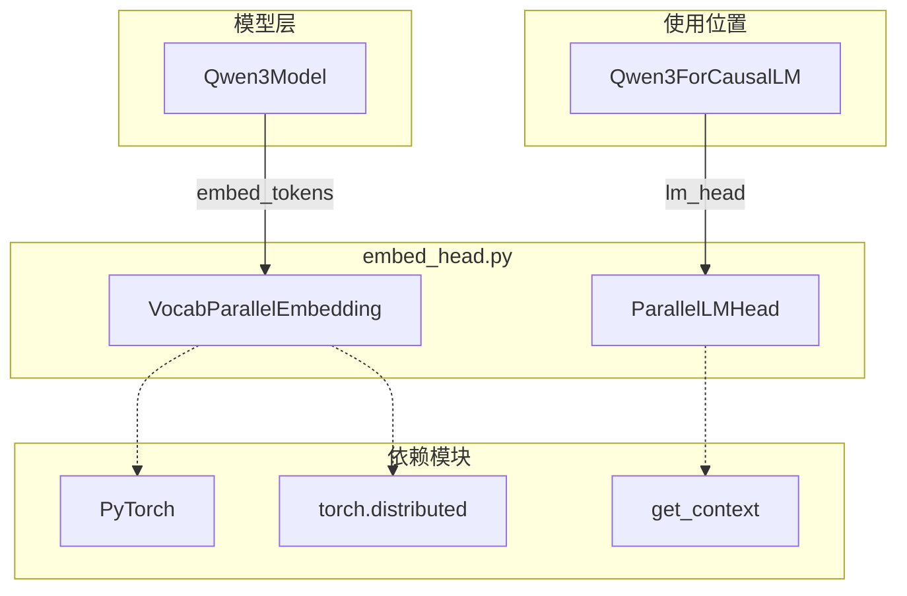
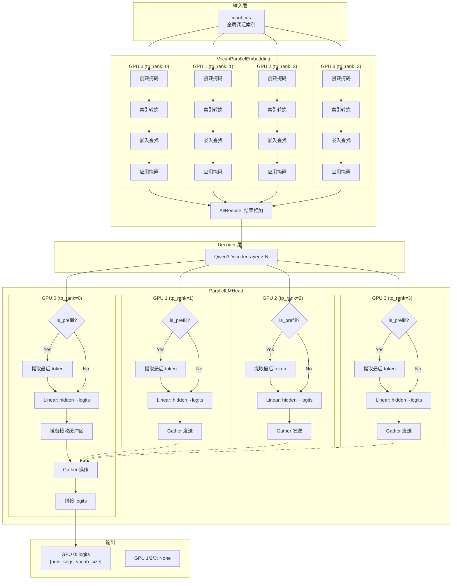
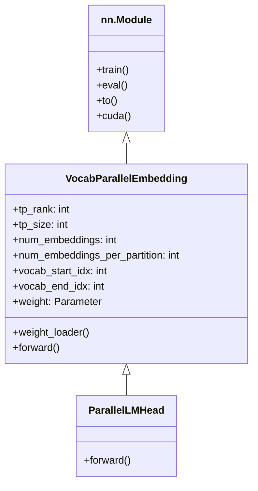

# 嵌入层与输出头详解

## 一、模块概述

`nanovllm/layers/embed_head.py` 实现了词汇表并行的嵌入层和语言模型输出头，是 Nano-vLLM 支持张量并行的关键组件。

### 1.1 核心组件

| 组件 | 功能 | 输入 | 输出 |
|------|------|------|------|
| **VocabParallelEmbedding** | 词嵌入查找 | `[batch, seq_len]` token IDs | `[batch, seq_len, hidden_size]` 嵌入向量 |
| **ParallelLMHead** | 词汇表 logits 计算 | `[total_tokens, hidden_size]` 隐藏状态 | `[num_seqs, vocab_size]` logits |

### 1.2 张量并行策略

```
词汇表并行 (Vocabulary Parallelism):

完整词汇表 (vocab_size=32000):
┌─────────────────────────────────────────────────────────┐
│ token:    0 │  1000 │  8000 │  16000 │  24000 │  31999 │
├───────────┼───────┼───────┼────────┼────────┼─────────┤
│ GPU 0     │ GPU 0 │ GPU 1│ GPU 2  │ GPU 3  │ GPU 3   │
│ [0:8000)  │       │[8k:16k)│[16k:24k)│[24k:32k)│         │
└─────────────────────────────────────────────────────────┘

每个 GPU 只存储部分词汇的嵌入权重:
- GPU 0: weight[0:8000, :]
- GPU 1: weight[8000:16000, :]
- GPU 2: weight[16000:24000, :]
- GPU 3: weight[24000:32000, :]
```

### 1.3 模块依赖关系



---

## 二、VocabParallelEmbedding 详解

### 2.1 类结构

```python
class VocabParallelEmbedding(nn.Module):
    """
    词汇表并行的词嵌入层
    
    将词汇表均匀切分到多个 GPU 上，每个 GPU 只存储部分词汇的嵌入向量。
    """
    
    # 核心属性
    tp_rank: int                        # 当前 GPU 的排名
    tp_size: int                        # GPU 总数
    num_embeddings: int                 # 完整词汇表大小
    num_embeddings_per_partition: int   # 当前 GPU 存储的词汇数
    vocab_start_idx: int                # 当前 GPU 负责的起始索引
    vocab_end_idx: int                  # 当前 GPU 负责的结束索引
    weight: nn.Parameter                # 嵌入权重矩阵
    
    # 核心方法
    __init__()                          # 初始化
    weight_loader()                     # 权重加载
    forward()                           # 前向传播
```

### 2.2 初始化流程

```python
def __init__(self, num_embeddings: int, embedding_dim: int):
    super().__init__()
    
    # 1. 获取分布式环境信息
    self.tp_rank = dist.get_rank()       # 当前 GPU 排名
    self.tp_size = dist.get_world_size() # GPU 总数
    
    # 2. 验证可整除性
    assert num_embeddings % self.tp_size == 0
    
    # 3. 计算词汇表切分
    self.num_embeddings = num_embeddings
    self.num_embeddings_per_partition = num_embeddings // self.tp_size
    self.vocab_start_idx = self.num_embeddings_per_partition * self.tp_rank
    self.vocab_end_idx = self.vocab_start_idx + self.num_embeddings_per_partition
    
    # 4. 创建嵌入权重（只存储部分词汇）
    self.weight = nn.Parameter(
        torch.empty(self.num_embeddings_per_partition, embedding_dim)
    )
    
    # 5. 绑定权重加载器
    self.weight.weight_loader = self.weight_loader
```

### 2.3 权重加载器

```python
def weight_loader(self, param: nn.Parameter, loaded_weight: torch.Tensor):
    """
    从完整预训练权重中加载当前 partition 的部分
    
    Args:
        param: 当前 partition 的参数
        loaded_weight: 完整的预训练权重 [vocab_size, embedding_dim]
    """
    param_data = param.data
    shard_size = param_data.size(0)  # 当前 partition 大小
    
    # 计算在完整权重中的起始位置
    start_idx = self.tp_rank * shard_size
    
    # 从完整权重中切分出当前 GPU 负责的部分
    loaded_weight = loaded_weight.narrow(0, start_idx, shard_size)
    
    # 复制到当前参数
    param_data.copy_(loaded_weight)
```

**图示**：
```
完整预训练权重 (HuggingFace 格式):
┌─────────────────────────────────────┐
│ [0:32000, :]                        │
│ ┌─────────────────────────────────┐ │
│ │ token 0-7999                    │ │ ← GPU 0 加载 (tp_rank=0)
│ ├─────────────────────────────────┤ │
│ │ token 8000-15999                │ │ ← GPU 1 加载 (tp_rank=1)
│ ├─────────────────────────────────┤ │
│ │ token 16000-23999               │ │ ← GPU 2 加载 (tp_rank=2)
│ ├─────────────────────────────────┤ │
│ │ token 24000-31999               │ │ ← GPU 3 加载 (tp_rank=3)
│ └─────────────────────────────────┘ │
└─────────────────────────────────────┘

每个 GPU 加载后:
GPU 0: weight.shape = [8000, 4096]
GPU 1: weight.shape = [8000, 4096]
GPU 2: weight.shape = [8000, 4096]
GPU 3: weight.shape = [8000, 4096]
```

### 2.4 前向传播详解

```python
def forward(self, x: torch.Tensor):
    """
    词嵌入前向传播
    
    Args:
        x: 输入 token IDs, 形状为 [batch_size, seq_len]
    
    Returns:
        嵌入向量，形状为 [batch_size, seq_len, embedding_dim]
    """
    # ========== 步骤 1: 掩码处理 (tp_size > 1) ==========
    if self.tp_size > 1:
        # 创建掩码：标记哪些 token 在当前 GPU 的词汇范围内
        mask = (x >= self.vocab_start_idx) & (x < self.vocab_end_idx)
        
        # 将全局索引转换为局部索引
        # 不在范围内的 token 映射到 0（后续会被掩码置零）
        x = mask * (x - self.vocab_start_idx)
    
    # ========== 步骤 2: 嵌入查找 ==========
    y = F.embedding(x, self.weight)
    
    # ========== 步骤 3: 应用掩码并 AllReduce (tp_size > 1) ==========
    if self.tp_size > 1:
        # 应用掩码：将不在当前 GPU 范围内的 token 嵌入置零
        y = mask.unsqueeze(1) * y
        
        # AllReduce: 所有 GPU 的结果相加
        dist.all_reduce(y)
    
    return y
```

### 2.5 前向传播示例

```
输入示例:
x = [0, 5000, 10000, 20000, 30000]  (5 个 token)
配置：vocab_size=32000, tp_size=4, 每个 GPU 负责 8000 个词

═══════════════════════════════════════════════════════════

GPU 0 (tp_rank=0, vocab_range=[0, 8000)):
───────────────────────────────────────────────────────────
1. mask = [True, True, False, False, False]
   - token 0 和 5000 在范围内
   - token 10000, 20000, 30000 不在范围内

2. x_local = mask * (x - 0)
   = [0, 5000, 0, 0, 0]
   - 范围内的 token 转换为局部索引
   - 范围外的 token 映射到 0

3. y = F.embedding(x_local, weight)
   = [emb[0], emb[5000], emb[0], emb[0], emb[0]]
   - 使用局部索引查找嵌入

4. y = mask.unsqueeze(1) * y
   = [emb[0], emb[5000], 0, 0, 0]
   - 范围外的 token 嵌入置零

5. dist.all_reduce(y)
   = [emb[0], emb[5000], 0, 0, 0] + 其他 GPU 的结果

═══════════════════════════════════════════════════════════

GPU 1 (tp_rank=1, vocab_range=[8000, 16000)):
───────────────────────────────────────────────────────────
1. mask = [False, False, True, False, False]
   - 只有 token 10000 在范围内

2. x_local = mask * (x - 8000)
   = [0, 0, 2000, 0, 0]
   - 10000 - 8000 = 2000 (局部索引)

3. y = F.embedding(x_local, weight)
   = [emb[0], emb[0], emb[2000], emb[0], emb[0]]

4. y = mask.unsqueeze(1) * y
   = [0, 0, emb[10000], 0, 0]

5. dist.all_reduce(y)
   = [0, 0, emb[10000], 0, 0] + 其他 GPU 的结果

═══════════════════════════════════════════════════════════

GPU 2 (tp_rank=2, vocab_range=[16000, 24000)):
───────────────────────────────────────────────────────────
1. mask = [False, False, False, True, False]
   - 只有 token 20000 在范围内

2. x_local = mask * (x - 16000)
   = [0, 0, 0, 4000, 0]
   - 20000 - 16000 = 4000

3-5. 类似处理...
   最终贡献：[0, 0, 0, emb[20000], 0]

═══════════════════════════════════════════════════════════

GPU 3 (tp_rank=3, vocab_range=[24000, 32000)):
───────────────────────────────────────────────────────────
1. mask = [False, False, False, False, True]
   - 只有 token 30000 在范围内

2. x_local = mask * (x - 24000)
   = [0, 0, 0, 0, 6000]
   - 30000 - 24000 = 6000

3-5. 类似处理...
   最终贡献：[0, 0, 0, 0, emb[30000]]

═══════════════════════════════════════════════════════════

AllReduce 后 (所有 GPU 得到相同结果):
y = [emb[0], emb[5000], emb[10000], emb[20000], emb[30000]]
形状：[batch_size=1, seq_len=5, embedding_dim=4096]
```

### 2.6 掩码机制详解

```python
# 为什么需要掩码？
# 问题：不同 GPU 存储不同的词汇，如何处理任意输入？

# 解决方案：掩码 + 局部索引转换

# 步骤 1: 创建掩码
mask = (x >= vocab_start_idx) & (x < vocab_end_idx)
# mask[i] = True  表示 token[i] 在当前 GPU 范围内
# mask[i] = False 表示 token[i] 不在当前 GPU 范围

# 步骤 2: 索引转换
x_local = mask * (x - vocab_start_idx)
# 范围内：x_local = x - vocab_start_idx (转换为局部索引)
# 范围外：x_local = 0 (映射到 0，避免索引越界)

# 步骤 3: 嵌入查找
y = F.embedding(x_local, weight)
# 使用局部索引查找嵌入向量

# 步骤 4: 应用掩码
y = mask.unsqueeze(1) * y
# 范围内：保持不变
# 范围外：置零

# 步骤 5: AllReduce
dist.all_reduce(y)
# 所有 GPU 的结果相加，得到完整嵌入
```

---

## 三、ParallelLMHead 详解

### 3.1 类结构

```python
class ParallelLMHead(VocabParallelEmbedding):
    """
    词汇表并行的语言模型输出头
    
    继承自 VocabParallelEmbedding，共享词汇表并行策略。
    将隐藏状态映射到词汇表上的 logits 分布。
    """
    
    # 继承的属性
    tp_rank: int
    tp_size: int
    vocab_start_idx: int
    vocab_end_idx: int
    weight: nn.Parameter
    
    # 核心方法
    __init__()     # 初始化
    forward()      # 前向传播：计算 logits
```

### 3.2 初始化

```python
def __init__(
    self,
    num_embeddings: int,
    embedding_dim: int,
    bias: bool = False,
):
    # 不支持偏置
    assert not bias
    
    # 调用父类初始化
    super().__init__(num_embeddings, embedding_dim)
```

### 3.3 前向传播详解

```python
def forward(self, x: torch.Tensor):
    """
    LM 头前向传播：计算词汇表 logits
    
    Args:
        x: 隐藏状态，形状为 [total_tokens, hidden_size]
            - total_tokens 是所有序列的 token 总数（变长）
    
    Returns:
        logits: 词汇表 logits
            - rank=0: [num_seqs, vocab_size]
            - rank>0: None
    """
    # ========== 步骤 1: 获取上下文 ==========
    context = get_context()
    
    # ========== 步骤 2: Prefill 模式处理 ==========
    if context.is_prefill:
        # 只提取每个序列最后一个 token 的 logits
        # cu_seqlens_q[1:] 是每个序列的结束位置
        last_indices = context.cu_seqlens_q[1:] - 1
        x = x[last_indices].contiguous()
    
    # ========== 步骤 3: 计算 logits (当前 GPU 负责的部分) ==========
    logits = F.linear(x, self.weight)
    # logits.shape = [num_tokens, num_embeddings_per_partition]
    
    # ========== 步骤 4: Gather 操作 (tp_size > 1) ==========
    if self.tp_size > 1:
        # rank=0 准备接收缓冲区
        if self.tp_rank == 0:
            all_logits = [torch.empty_like(logits) for _ in range(self.tp_size)]
        else:
            all_logits = None
        
        # 将所有 GPU 的 logits gather 到 rank=0
        dist.gather(logits, all_logits, 0)
        
        # rank=0 拼接所有 logits
        logits = torch.cat(all_logits, -1) if self.tp_rank == 0 else None
    
    return logits
```

### 3.4 Prefill 模式处理

```python
if context.is_prefill:
    # Prefill 模式：只提取每个序列最后一个 token 的 logits
    last_indices = context.cu_seqlens_q[1:] - 1
    x = x[last_indices].contiguous()
```

**图示**：
```
输入隐藏状态 (所有 token):
┌─────────────────────────────────────────────────────────┐
│ Seq0: [h0_0, h0_1, h0_2, ..., h0_n]                     │
│ Seq1: [h1_0, h1_1, h1_2, ..., h1_m]                     │
│ Seq2: [h2_0, h2_1, h2_2, ..., h2_k]                     │
└─────────────────────────────────────────────────────────┘

cu_seqlens_q:
[0, n+1, n+1+m+1, n+1+m+1+k+1]
 │   │        │          │
 │   │        │          └─ Seq2 结束位置
 │   │        └─ Seq1 结束位置
 │   └─ Seq0 结束位置
 └─ 起始位置

last_indices = cu_seqlens_q[1:] - 1:
[n, n+m+1, n+m+k+2]
 │   │      │
 │   │      └─ Seq2 最后一个 token 索引
 │   └─ Seq1 最后一个 token 索引
 └─ Seq0 最后一个 token 索引

提取后:
x = [h0_n, h1_(n+m+1), h2_(n+m+k+2)]
    └────┘ └────────┘ └────────┘
     Seq0   Seq1     Seq2
```

### 3.5 为什么只提取最后一个 token 的 logits？

**核心原因**：在自回归生成中，只有最后一个 token 的 logits 用于采样生成**下一个 token**。

#### Prefill 阶段 vs Decode 阶段

```
Prefill 阶段 (处理用户输入 prompt):
─────────────────────────────────────────────────────────
用户输入："Hello, how are"

输入 token:  [Hello] [how] [are]
                │      │      │
                ▼      ▼      ▼
隐藏状态：   [h₀]   [h₁]   [h₂]
                │      │      │
                │      │      └─→ 提取 logits → 采样生成第一个输出 token "you"
                │      │
                │      └─→ 不提取 logits (仅用于计算 KV Cache)
                │
                └─→ 不提取 logits (仅用于计算 KV Cache)

关键点:
- 所有输入 token 都要计算 KV Cache (用于后续 Decode 阶段)
- 但只有最后一个 token 的 logits 用于生成下一个输出 token
- 中间 token 的 logits 不需要 (浪费计算)
```

```
Decode 阶段 (逐 token 生成):
─────────────────────────────────────────────────────────
已生成："Hello, how are you"

输入 token:  [you]  (上一个生成的 token)
              │
              ▼
隐藏状态：   [h₃]
              │
              └─→ 计算 logits → 采样生成下一个输出 token " doing"

关键点:
- 每次只输入上一个生成的 token
- 计算 logits 采样生成下一个 token
- 此时只有一个 token，自然就是"最后一个"
```

#### 两阶段对比

| 阶段 | 输入 | 提取的 logits | 生成的 token |
|------|------|--------------|-------------|
| **Prefill** | 完整 prompt (n 个 token) | 第 n-1 个 token (最后一个) | 第 1 个输出 token |
| **Decode** | 上一个生成的 token (1 个) | 该 token (唯一的) | 下一个输出 token |

#### 完整生成流程示例

```
用户输入："Hello, how are"
期望输出："Hello, how are you doing today"

═══════════════════════════════════════════════════════════

Step 1 - Prefill 阶段:
─────────────────────────────────────────────────────────
输入：["Hello", "how", "are"]
      └─ 计算所有 token 的 KV Cache
      └─ 只提取 "are" 的 logits
      
输出：采样生成 "you"

═══════════════════════════════════════════════════════════

Step 2 - Decode (第 1 次):
─────────────────────────────────────────────────────────
输入：["you"]
      └─ 使用 KV Cache + 计算 "you" 的 KV
      └─ 提取 "you" 的 logits
      
输出：采样生成 " doing"

═══════════════════════════════════════════════════════════

Step 3 - Decode (第 2 次):
─────────────────────────────────────────────────────────
输入：[" doing"]
      └─ 使用 KV Cache + 计算 " doing" 的 KV
      └─ 提取 " doing" 的 logits
      
输出：采样生成 " today"

═══════════════════════════════════════════════════════════

Step 4 - Decode (第 3 次):
─────────────────────────────────────────────────────────
输入：[" today"]
      └─ 使用 KV Cache + 计算 " today" 的 KV
      └─ 提取 " today" 的 logits
      
输出：采样生成 "<EOS>" (结束)

═══════════════════════════════════════════════════════════

最终输出："you doing today"
完整响应："Hello, how are you doing today"
```

#### 为什么这样设计？

**1. 节省计算资源**

```python
# 假设 prompt 有 100 个 token

# ❌ 低效做法：计算所有 token 的 logits
for i in range(100):
    logits = F.linear(hidden_states[i], weight)  # 100 次矩阵乘法
# 只有最后 1 个 logits 有用，前 99 次计算浪费

# ✅ 高效做法：只计算最后一个 token 的 logits
last_idx = 99
logits = F.linear(hidden_states[last_idx], weight)  # 1 次矩阵乘法
# 节省 99% 的计算量
```

**2. 符合自回归生成原理**

```
自回归生成 (Autoregressive Generation):
P(y₁, y₂, ..., yₙ | x) = P(y₁ | x) × P(y₂ | x, y₁) × ... × P(yₙ | x, y₁...yₙ₋₁)

每次只生成一个 token，条件是所有之前的 token。
因此只需要最后一个 token 的状态来预测下一个 token。
```

**3. KV Cache 已经包含所有信息**

```
KV Cache 的作用:
- 存储所有历史 token 的 K 和 V
- 新 token 的 Attention 可以访问所有历史信息
- 因此只需要最后一个 token 的隐藏状态即可

隐藏状态 → KV Cache → Attention → 下一个 token
    │                            ▲
    └────────────────────────────┘
         最后一个 token 足够
```

### 3.6 Gather 操作详解

```python
if self.tp_size > 1:
    # rank=0 准备接收缓冲区
    if self.tp_rank == 0:
        all_logits = [torch.empty_like(logits) for _ in range(self.tp_size)]
    else:
        all_logits = None
    
    # Gather: 所有 GPU 的 logits 汇聚到 rank=0
    dist.gather(logits, all_logits, 0)
    
    # rank=0 拼接所有 logits
    logits = torch.cat(all_logits, -1) if self.tp_rank == 0 else None
```

**图示**：
```
Gather 操作 (tp_size=4):

GPU 0 (tp_rank=0):
┌─────────────────────────────────────┐
│ logits_0 = linear(x, weight_0)      │
│ shape: [num_tokens, 8000]           │
│                                     │
│ 准备 all_logits 缓冲区:              │
│ [empty_0, empty_1, empty_2, empty_3]│
│                                     │
│ dist.gather() 后:                   │
│ all_logits = [logits_0, logits_1,   │
│               logits_2, logits_3]   │
│                                     │
│ 拼接后:                             │
│ logits = cat(all_logits, -1)        │
│ shape: [num_tokens, 32000]          │
└─────────────────────────────────────┘

GPU 1 (tp_rank=1):
┌─────────────────────────────────────┐
│ logits_1 = linear(x, weight_1)      │
│ shape: [num_tokens, 8000]           │
│                                     │
│ all_logits = None                   │
│                                     │
│ dist.gather() 发送 logits_1 到 GPU 0 │
│                                     │
│ 返回：logits = None                 │
└─────────────────────────────────────┘

GPU 2 (tp_rank=2):
┌─────────────────────────────────────┐
│ logits_2 = linear(x, weight_2)      │
│ shape: [num_tokens, 8000]           │
│                                     │
│ dist.gather() 发送 logits_2 到 GPU 0 │
│                                     │
│ 返回：logits = None                 │
└─────────────────────────────────────┘

GPU 3 (tp_rank=3):
┌─────────────────────────────────────┐
│ logits_3 = linear(x, weight_3)      │
│ shape: [num_tokens, 8000]           │
│                                     │
│ dist.gather() 发送 logits_3 到 GPU 0 │
│                                     │
│ 返回：logits = None                 │
└─────────────────────────────────────┘

最终结果:
GPU 0: logits.shape = [num_tokens, 32000]  (完整词汇表)
GPU 1/2/3: logits = None
```

---

## 四、通信原语对比

### 4.1 AllReduce (VocabParallelEmbedding)

```
AllReduce 操作:
GPU 0: [y0, 0,  0,  0]  ─┐
GPU 1: [0,  y1, 0,  0]  ─┼── AllReduce ──► [y0, y1, y2, y3] (所有 GPU 相同)
GPU 2: [0,  0,  y2, 0]  ─┤
GPU 3: [0,  0,  0,  y3] ─┘

特点:
- 所有 GPU 得到相同的结果
- 结果是所有 GPU 输入的和 (元素级相加)
- 用于 Embedding 层，因为所有 GPU 都需要完整的嵌入结果
```

### 4.2 Gather (ParallelLMHead)

```
Gather 操作:
GPU 0: logits_0 ─┐
GPU 1: logits_1 ─┼── Gather(0) ──► GPU 0: [logits_0, logits_1, logits_2, logits_3]
GPU 2: logits_2 ─┤                 GPU 1/2/3: None
GPU 3: logits_3 ─┘

特点:
- 只有目标 GPU (rank=0) 得到完整结果
- 其他 GPU 返回 None
- 用于 LM Head，因为只有 rank=0 需要完整 logits 进行采样
```

### 4.3 为什么使用不同的通信方式？

| 层面 | 通信方式 | 原因 |
|------|----------|------|
| **VocabParallelEmbedding** | AllReduce | 所有 GPU 都需要完整的嵌入结果用于后续 Decoder 层计算 |
| **ParallelLMHead** | Gather | 只有 rank=0 需要完整 logits 用于采样，减少通信开销 |

---

## 五、完整数据流图



---

## 六、继承关系

### 6.1 类继承图



### 6.2 属性继承

```python
# VocabParallelEmbedding 的属性 (全部继承给 ParallelLMHead)
class VocabParallelEmbedding(nn.Module):
    tp_rank                         # 当前 GPU 排名
    tp_size                         # GPU 总数
    num_embeddings                  # 完整词汇表大小
    num_embeddings_per_partition    # 当前 GPU 存储的词汇数
    vocab_start_idx                 # 当前 GPU 负责的起始索引
    vocab_end_idx                   # 当前 GPU 负责的结束索引
    weight                          # 嵌入权重矩阵
    weight_loader()                 # 权重加载方法

# ParallelLMHead 继承所有上述属性
class ParallelLMHead(VocabParallelEmbedding):
    # 共享相同的 weight 矩阵
    # 共享相同的 vocab 切分策略
    # 只是 forward() 方法不同
```

---

## 七、使用示例

### 7.1 基本使用

```python
import torch
import torch.distributed as dist
from nanovllm.layers.embed_head import VocabParallelEmbedding, ParallelLMHead

# 初始化分布式环境
dist.init_process_group(backend="nccl")

# 配置
vocab_size = 32000
hidden_size = 4096
batch_size = 2
seq_len = 100

# ========== VocabParallelEmbedding ==========
emb = VocabParallelEmbedding(vocab_size, hidden_size)

# 输入：全局词汇索引
input_ids = torch.randint(0, vocab_size, (batch_size, seq_len))

# 前向传播
embedded = emb(input_ids)
print(f"Embedded shape: {embedded.shape}")
# 输出：[batch_size, seq_len, hidden_size]

# ========== ParallelLMHead ==========
lm_head = ParallelLMHead(vocab_size, hidden_size)

# 输入：隐藏状态
hidden_states = torch.randn(batch_size * seq_len, hidden_size)

# 前向传播
logits = lm_head(hidden_states)
# rank=0: [batch_size * seq_len, vocab_size]
# rank>0: None
```

### 7.2 在 Qwen3 模型中的使用

```python
# nanovllm/models/qwen3.py
class Qwen3Model(nn.Module):
    def __init__(self, config):
        # 词嵌入层
        self.embed_tokens = VocabParallelEmbedding(
            config.vocab_size, 
            config.hidden_size
        )
        
        # Decoder 层
        self.layers = nn.ModuleList([...])
        
        # 最终归一化
        self.norm = RMSNorm(config.hidden_size)

class Qwen3ForCausalLM(nn.Module):
    def __init__(self, config):
        self.model = Qwen3Model(config)
        
        # 语言模型输出头
        self.lm_head = ParallelLMHead(
            config.vocab_size, 
            config.hidden_size
        )
        
        # 权重绑定 (可选)
        if config.tie_word_embeddings:
            self.lm_head.weight.data = self.model.embed_tokens.weight.data
```

---

## 八、性能优化

### 8.1 内存优化

| 配置 | 每 GPU 嵌入层内存 | 总内存 |
|------|-----------------|--------|
| **单 GPU (tp=1)** | vocab×hidden×4B | 100% |
| **双 GPU (tp=2)** | 50% | 100% |
| **四 GPU (tp=4)** | 25% | 100% |
| **八 GPU (tp=8)** | 12.5% | 100% |

### 8.2 通信开销

| 操作 | 通信量 | 频率 |
|------|--------|------|
| **AllReduce** | hidden_size × 4B × seq_len | 每次 Embedding 前向 |
| **Gather** | vocab_size/tp_size × 4B × num_tokens | 每次 LM Head 前向 |

### 8.3 优化建议

1. **大词汇表场景**：使用更大的 tp_size 减少每 GPU 内存
2. **长序列场景**：注意 AllReduce 的通信开销
3. **大批次场景**：Gather 操作可能成为瓶颈

---

## 九、总结

### 9.1 核心设计

| 组件 | 并行策略 | 通信方式 | 输出分布 |
|------|----------|----------|----------|
| **VocabParallelEmbedding** | 词汇表切分 | AllReduce | 所有 GPU 相同 |
| **ParallelLMHead** | 词汇表切分 | Gather | 仅 rank=0 |

### 9.2 关键公式

```python
# 词汇表切分
partition_size = vocab_size // tp_size
start_idx = partition_size * tp_rank
end_idx = start_idx + partition_size

# 掩码创建
mask = (x >= start_idx) & (x < end_idx)

# 索引转换
x_local = mask * (x - start_idx)

# 嵌入查找
y = F.embedding(x_local, weight)

# 掩码应用
y = mask.unsqueeze(1) * y

# AllReduce
dist.all_reduce(y)

# Logits 计算
logits = F.linear(x, weight)

# Gather
dist.gather(logits, all_logits, 0)
logits = cat(all_logits, -1) if rank == 0 else None
```

### 9.3 与其他模块的关系

```
embed_head.py 在整个架构中的位置:

输入 → VocabParallelEmbedding → Qwen3DecoderLayer × N → ParallelLMHead → 采样 → 输出
         │                                                    │
         └────────────── 词汇表并行 ──────────────────────────┘
```

</content>