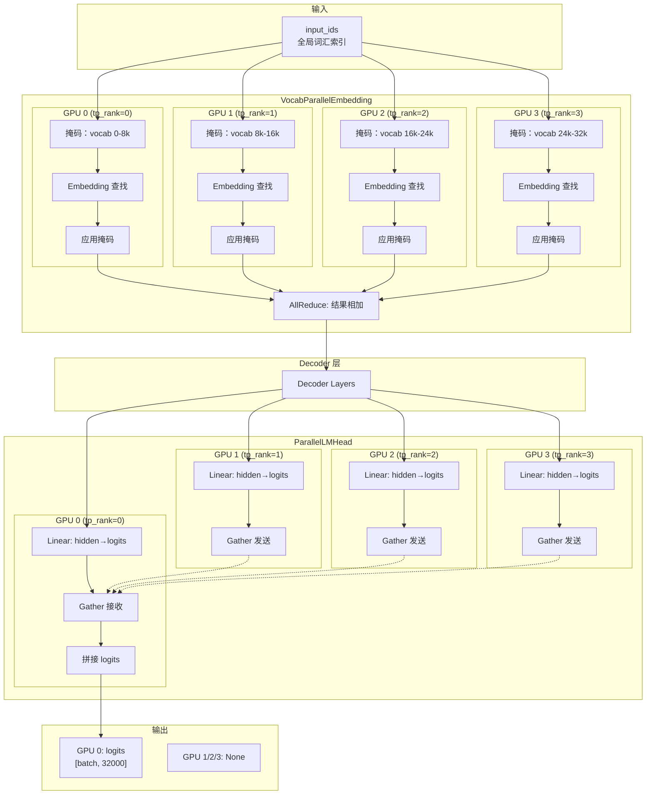

# 张量并行基础：tp_rank 和 tp_size

## 一、核心概念

### 1.1 什么是张量并行

**张量并行 (Tensor Parallelism)** 是一种模型并行策略，将模型的权重张量切分到多个 GPU 上进行计算。

```
单 GPU 推理：
┌─────────────────────────────────┐
│         完整模型权重             │
│         W [hidden, vocab]       │
│         32000 × 4096            │
└─────────────────────────────────┘

张量并行 (tp_size=4)：
┌───────────┬───────────┬───────────┬───────────┐
│  GPU 0    │  GPU 1    │  GPU 2    │  GPU 3    │
│ W[0:8k]   │ W[8k:16k] │ W[16k:24k]│ W[24k:32k]│
└───────────┴───────────┴───────────┴───────────┘
```

### 1.2 tp_rank 和 tp_size 定义

| 变量 | 含义 | 获取方式 | 取值范围 |
|------|------|----------|----------|
| **`tp_rank`** | 当前进程在张量并行组中的排名 | `dist.get_rank()` | `0` 到 `tp_size-1` |
| **`tp_size`** | 张量并行大小（GPU 数量） | `dist.get_world_size()` | `1, 2, 4, 8, ...` |

### 代码定义

```python
# nanovllm/layers/embed_head.py
class VocabParallelEmbedding(nn.Module):
    def __init__(self, num_embeddings: int, embedding_dim: int):
        super().__init__()
        
        # 获取当前进程的 tp_rank 和 tp_size
        self.tp_rank = dist.get_rank()       # 当前 GPU 的排名
        self.tp_size = dist.get_world_size() # GPU 总数
        
        # 计算当前 GPU 负责的词汇范围
        self.num_embeddings_per_partition = num_embeddings // self.tp_size
        self.vocab_start_idx = self.num_embeddings_per_partition * self.tp_rank
        self.vocab_end_idx = self.vocab_start_idx + self.num_embeddings_per_partition
```

---

## 二、tp_rank 和 tp_size 的关系

### 2.1 示例场景

假设 `vocab_size = 32000`, `tp_size = 4`：

```
GPU 分布：
┌────────────────────────────────────────────────────────────────┐
│  GPU 0      │  GPU 1      │  GPU 2      │  GPU 3              │
│  tp_rank=0  │  tp_rank=1  │  tp_rank=2  │  tp_rank=3          │
├────────────────────────────────────────────────────────────────┤
│  vocab[0:   │  vocab[8k:  │  vocab[16k: │  vocab[24k:         │
│       8k]   │      16k]   │      24k]   │       32k]          │
└────────────────────────────────────────────────────────────────┘
```

### 2.2 词汇表切分计算

```python
# 每个 GPU 负责的词汇数量
num_embeddings_per_partition = vocab_size // tp_size
                           = 32000 // 4 = 8000

# 每个 GPU 的词汇范围
GPU 0: vocab_start_idx = 8000 * 0 = 0
       vocab_end_idx   = 0 + 8000 = 8000
       负责词汇：[0, 8000)

GPU 1: vocab_start_idx = 8000 * 1 = 8000
       vocab_end_idx   = 8000 + 8000 = 16000
       负责词汇：[8000, 16000)

GPU 2: vocab_start_idx = 8000 * 2 = 16000
       vocab_end_idx   = 16000 + 8000 = 24000
       负责词汇：[16000, 24000)

GPU 3: vocab_start_idx = 8000 * 3 = 24000
       vocab_end_idx   = 24000 + 8000 = 32000
       负责词汇：[24000, 32000)
```

### 2.3 通用公式

```python
# 每个 partition 的大小
partition_size = total_size // tp_size

# rank 负责的起始索引
start_idx = partition_size * tp_rank

# rank 负责的结束索引
end_idx = start_idx + partition_size
```

---

## 三、在 VocabParallelEmbedding 中的应用

### 3.1 权重存储

```python
# 每个 GPU 只存储部分词汇的嵌入权重
self.weight = nn.Parameter(
    torch.empty(self.num_embeddings_per_partition, embedding_dim)
)

# GPU 0: weight.shape = [8000, 4096]
# GPU 1: weight.shape = [8000, 4096]
# GPU 2: weight.shape = [8000, 4096]
# GPU 3: weight.shape = [8000, 4096]

# 完整词汇表嵌入 = 所有 GPU 的 weight 拼接
# [32000, 4096] = cat([GPU0, GPU1, GPU2, GPU3], dim=0)
```

### 3.2 权重加载

```python
def weight_loader(self, param: nn.Parameter, loaded_weight: torch.Tensor):
    """
    从完整预训练权重中加载当前 partition 的部分
    """
    param_data = param.data
    shard_size = param_data.size(0)  # 8000
    
    # 计算当前 GPU 在完整权重中的起始位置
    start_idx = self.tp_rank * shard_size  # GPU0:0, GPU1:8000, ...
    
    # 从完整权重中切分出当前 GPU 负责的部分
    loaded_weight = loaded_weight.narrow(0, start_idx, shard_size)
    
    # 复制到当前参数
    param_data.copy_(loaded_weight)
```

**图示**：
```
完整权重 (HuggingFace):
┌─────────────────────────────┐
│  weight[0:32000, :]         │
│  ┌───────────────────────┐  │
│  │ token 0-7999          │  │ ← GPU 0 加载
│  ├───────────────────────┤  │
│  │ token 8000-15999      │  │ ← GPU 1 加载
│  ├───────────────────────┤  │
│  │ token 16000-23999     │  │ ← GPU 2 加载
│  ├───────────────────────┤  │
│  │ token 24000-31999     │  │ ← GPU 3 加载
│  └───────────────────────┘  │
└─────────────────────────────┘
```

### 3.3 前向传播

```python
def forward(self, x: torch.Tensor):
    """
    词嵌入前向传播
    
    Args:
        x: 输入 token IDs, 形状为 [batch_size, seq_len]
    
    Returns:
        嵌入向量，形状为 [batch_size, seq_len, embedding_dim]
    """
    if self.tp_size > 1:
        # 1. 创建掩码：标记哪些 token 在当前 GPU 的词汇范围内
        mask = (x >= self.vocab_start_idx) & (x < self.vocab_end_idx)
        
        # 2. 将全局索引转换为局部索引
        #    不在范围内的 token 映射到 0（后续会被掩码置零）
        x = mask * (x - self.vocab_start_idx)
    
    # 3. 查找嵌入向量（使用局部索引）
    y = F.embedding(x, self.weight)
    
    if self.tp_size > 1:
        # 4. 应用掩码：将不在当前 GPU 范围内的 token 嵌入置零
        y = mask.unsqueeze(1) * y
        
        # 5. AllReduce: 所有 GPU 的结果相加
        dist.all_reduce(y)
    
    return y
```

### 3.4 前向传播示例

```
输入：x = [0, 5000, 10000, 20000, 30000]  (5 个 token)

GPU 0 (tp_rank=0, vocab=[0:8000)):
┌─────────────────────────────────────────┐
│ 1. mask = [True, True, False, False, False] │
│ 2. x_local = [0, 5000, 0, 0, 0]            │
│ 3. y = embedding(x_local)                  │
│ 4. y = mask * y = [y0, y5000, 0, 0, 0]     │
│ 5. all_reduce: 与其他 GPU 相加              │
└─────────────────────────────────────────┘

GPU 1 (tp_rank=1, vocab=[8000:16000)):
┌─────────────────────────────────────────┐
│ 1. mask = [False, False, True, False, False] │
│ 2. x_local = [0, 0, 2000, 0, 0]         │ (10000-8000=2000)
│ 3. y = embedding(x_local)               │
│ 4. y = mask * y = [0, 0, y10000, 0, 0]  │
│ 5. all_reduce: 与其他 GPU 相加           │
└─────────────────────────────────────────┘

GPU 2 (tp_rank=2, vocab=[16000:24000)):
┌─────────────────────────────────────────┐
│ 1. mask = [False, False, False, True, False] │
│ 2. x_local = [0, 0, 0, 4000, 0]         │ (20000-16000=4000)
│ 3. y = embedding(x_local)               │
│ 4. y = mask * y = [0, 0, 0, y20000, 0]  │
│ 5. all_reduce: 与其他 GPU 相加           │
└─────────────────────────────────────────┘

GPU 3 (tp_rank=3, vocab=[24000:32000)):
┌─────────────────────────────────────────┐
│ 1. mask = [False, False, False, False, True] │
│ 2. x_local = [0, 0, 0, 0, 6000]         │ (30000-24000=6000)
│ 3. y = embedding(x_local)               │
│ 4. y = mask * y = [0, 0, 0, 0, y30000]  │
│ 5. all_reduce: 与其他 GPU 相加           │
└─────────────────────────────────────────┘

最终结果 (所有 GPU 相同):
y = [y0, y5000, y10000, y20000, y30000]
```

---

## 四、在 ParallelLMHead 中的应用

### 4.1 结构

```python
class ParallelLMHead(VocabParallelEmbedding):
    """
    词汇表并行的语言模型输出头
    
    继承自 VocabParallelEmbedding，共享相同的词汇表切分策略
    """
    
    def forward(self, x: torch.Tensor):
        context = get_context()
        
        # Prefill 模式：只提取每个序列最后一个 token
        if context.is_prefill:
            last_indices = context.cu_seqlens_q[1:] - 1
            x = x[last_indices].contiguous()
        
        # 计算 logits：只计算当前 GPU 负责的词汇部分
        logits = F.linear(x, self.weight)
        
        # 张量并行：收集所有 GPU 的 logits 到 rank=0
        if self.tp_size > 1:
            if self.tp_rank == 0:
                all_logits = [torch.empty_like(logits) for _ in range(self.tp_size)]
            else:
                all_logits = None
            
            # Gather: 所有 GPU 的 logits 汇聚到 rank=0
            dist.gather(logits, all_logits, 0)
            
            # Rank=0 拼接所有 logits
            logits = torch.cat(all_logits, -1) if self.tp_rank == 0 else None
        
        return logits
```

### 4.2 计算流程

```
输入：hidden_states (所有 GPU 相同)

GPU 0 (tp_rank=0, vocab=[0:8000)):
┌─────────────────────────────────────┐
│ logits_0 = linear(hidden, weight_0) │
│ shape: [batch, 8000]                │
│                                     │
│ dist.gather() → 发送到 GPU 0         │
│ 最终：logits = cat([l0, l1, l2, l3])│
│ shape: [batch, 32000]               │
└─────────────────────────────────────┘

GPU 1 (tp_rank=1, vocab=[8000:16000)):
┌─────────────────────────────────────┐
│ logits_1 = linear(hidden, weight_1) │
│ shape: [batch, 8000]                │
│                                     │
│ dist.gather() → 发送到 GPU 0         │
│ 最终：logits = None                 │
└─────────────────────────────────────┘

GPU 2 (tp_rank=2, vocab=[16000:24000)):
┌─────────────────────────────────────┐
│ logits_2 = linear(hidden, weight_2) │
│ shape: [batch, 8000]                │
│                                     │
│ dist.gather() → 发送到 GPU 0         │
│ 最终：logits = None                 │
└─────────────────────────────────────┘

GPU 3 (tp_rank=3, vocab=[24000:32000)):
┌─────────────────────────────────────┐
│ logits_3 = linear(hidden, weight_3) │
│ shape: [batch, 8000]                │
│                                     │
│ dist.gather() → 发送到 GPU 0         │
│ 最终：logits = None                 │
└─────────────────────────────────────┘
```

### 4.3 Gather 操作

```python
# GPU 0 准备接收缓冲区
all_logits = [
    torch.empty_like(logits_0),  # GPU 0 的 logits
    torch.empty_like(logits_1),  # GPU 1 的 logits
    torch.empty_like(logits_2),  # GPU 2 的 logits
    torch.empty_like(logits_3),  # GPU 3 的 logits
]

# dist.gather() 操作
# 所有 GPU 的 logits 汇聚到 GPU 0 的 all_logits 列表
dist.gather(logits, all_logits, 0)

# GPU 0 拼接所有 logits
logits = torch.cat(all_logits, dim=-1)  # [batch, 32000]
```

---

## 五、通信原语对比

### 5.1 AllReduce (VocabParallelEmbedding)

```
AllReduce = Reduce + Broadcast

GPU 0: [y0, 0,  0,  0]  ─┐
GPU 1: [0,  y1, 0,  0]  ─┼── AllReduce ──► [y0, y1, y2, y3] (所有 GPU 相同)
GPU 2: [0,  0,  y2, 0]  ─┤
GPU 3: [0,  0,  0,  y3] ─┘

特点：
- 所有 GPU 得到相同的结果
- 结果是所有 GPU 输入的和
```

### 5.2 Gather (ParallelLMHead)

```
Gather: 所有数据汇聚到指定 GPU

GPU 0: logits_0 ─┐
GPU 1: logits_1 ─┼── Gather(0) ──► GPU 0: [logits_0, logits_1, logits_2, logits_3]
GPU 2: logits_2 ─┤                 GPU 1/2/3: None
GPU 3: logits_3 ─┘

特点：
- 只有目标 GPU (rank=0) 得到完整结果
- 其他 GPU 返回 None
```

### 5.3 为什么使用不同的通信方式？

| 场景 | 通信方式 | 原因 |
|------|----------|------|
| **Embedding** | AllReduce | 所有 GPU 都需要完整的嵌入结果用于后续计算 |
| **LM Head** | Gather | 只有 rank=0 需要完整 logits 用于采样 |

---

## 六、不同 tp_size 的配置

### 6.1 tp_size = 1 (单 GPU)

```python
tp_rank = 0
tp_size = 1

# 词汇表不切分
vocab_start_idx = 0
vocab_end_idx = vocab_size

# 无需通信
if self.tp_size > 1:  # False，跳过
    ...
```

### 6.2 tp_size = 2 (双 GPU)

```
GPU 0 (tp_rank=0):
├── vocab_start_idx = 0
├── vocab_end_idx = 16000
└── 负责词汇：[0, 16000)

GPU 1 (tp_rank=1):
├── vocab_start_idx = 16000
├── vocab_end_idx = 32000
└── 负责词汇：[16000, 32000)
```

### 6.3 tp_size = 8 (八 GPU)

```
GPU 0 (tp_rank=0):   vocab [0:4000)
GPU 1 (tp_rank=1):   vocab [4000:8000)
GPU 2 (tp_rank=2):   vocab [8000:12000)
GPU 3 (tp_rank=3):   vocab [12000:16000)
GPU 4 (tp_rank=4):   vocab [16000:20000)
GPU 5 (tp_rank=5):   vocab [20000:24000)
GPU 6 (tp_rank=6):   vocab [24000:28000)
GPU 7 (tp_rank=7):   vocab [28000:32000)
```

---

## 七、内存优化分析

### 7.1 嵌入层内存对比

| 配置 | 每 GPU 内存 | 总内存 |
|------|-----------|--------|
| **单 GPU (tp=1)** | 32000 × 4096 × 4B = 512 MB | 512 MB |
| **双 GPU (tp=2)** | 16000 × 4096 × 4B = 256 MB | 512 MB |
| **四 GPU (tp=4)** | 8000 × 4096 × 4B = 128 MB | 512 MB |
| **八 GPU (tp=8)** | 4000 × 4096 × 4B = 64 MB | 512 MB |

### 7.2 优势

```
大模型场景 (vocab=256000, hidden=16384):

单 GPU:
- 嵌入层权重：256000 × 16384 × 4B ≈ 16 GB
- 可能超出单 GPU 显存

tp=8:
- 每 GPU 嵌入层权重：16 GB / 8 = 2 GB
- 可以轻松放入单 GPU
```

---

## 八、完整数据流图



---

## 九、总结

### 9.1 核心公式

```python
# 每个 partition 的大小
partition_size = total_size // tp_size

# tp_rank 负责的范围
start_idx = partition_size * tp_rank
end_idx = start_idx + partition_size

# 全局索引 → 局部索引
local_idx = global_idx - start_idx  (如果在范围内)
```

### 9.2 tp_rank 和 tp_size 对比表

| 属性 | tp_rank | tp_size |
|------|---------|---------|
| **含义** | 当前 GPU 的排名 | GPU 总数 |
| **获取方式** | `dist.get_rank()` | `dist.get_world_size()` |
| **取值范围** | `0` 到 `tp_size-1` | `1, 2, 4, 8, ...` |
| **是否可变** | 每个 GPU 不同 | 所有 GPU 相同 |
| **用途** | 确定当前 GPU 的身份 | 确定切分粒度 |

### 9.3 关键设计点

1. **词汇表切分**：每个 GPU 负责连续的词汇块
2. **掩码机制**：处理跨 partition 的词汇索引
3. **AllReduce**：Embedding 层所有 GPU 得到相同结果
4. **Gather**：LM Head 只有 rank=0 得到完整 logits
5. **权重加载**：从完整权重中切分对应部分

### 9.4 扩展到其他层

```python
# QKV 并行 (注意力层)
num_heads_per_gpu = total_num_heads // tp_size
num_kv_heads_per_gpu = total_num_kv_heads // tp_size

# MLP 并行
intermediate_size_per_gpu = intermediate_size // tp_size

# 通用模式：
# 1. 计算每 GPU 的大小
# 2. 根据 tp_rank 确定起始位置
# 3. 只处理本地数据
# 4. 通过通信合并结果
```

</content>
</write_file>