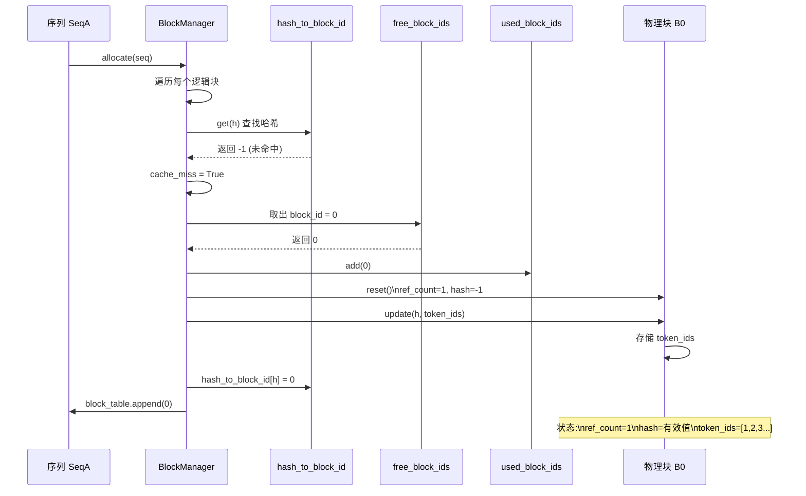
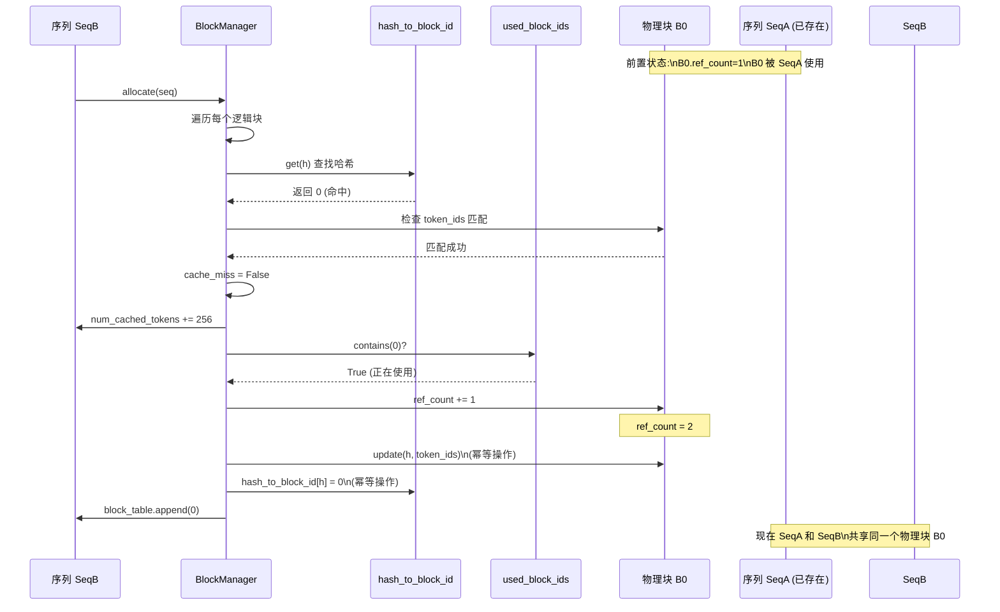
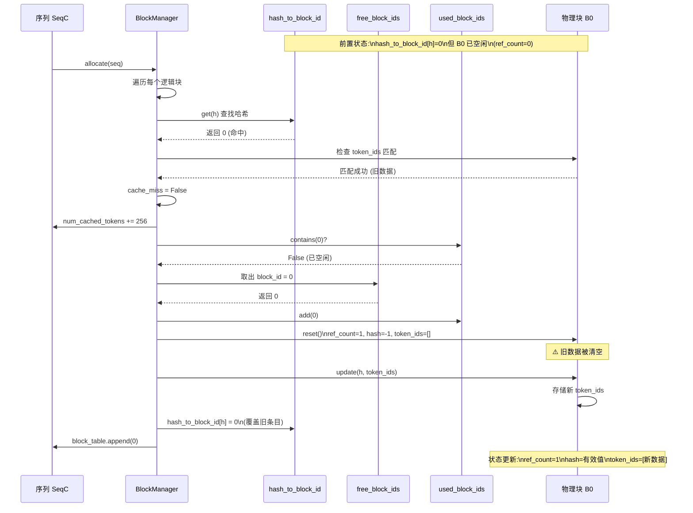
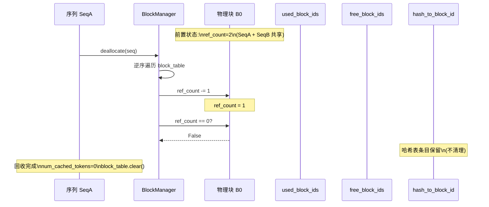
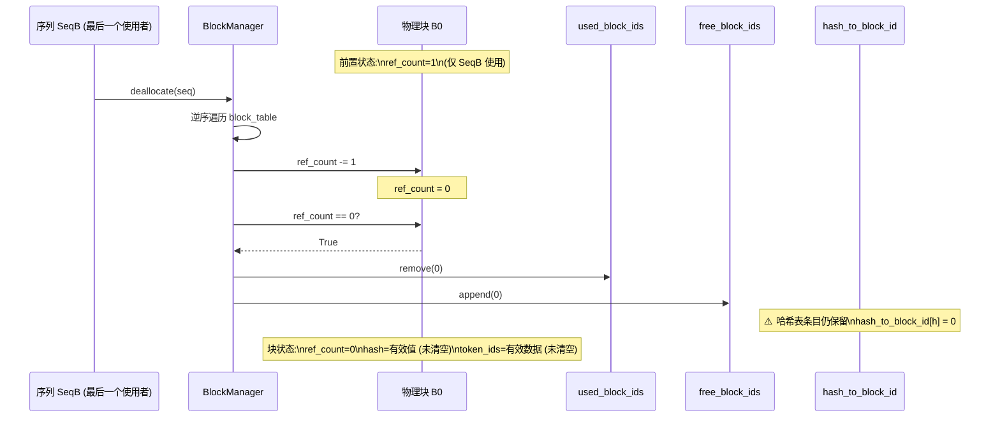
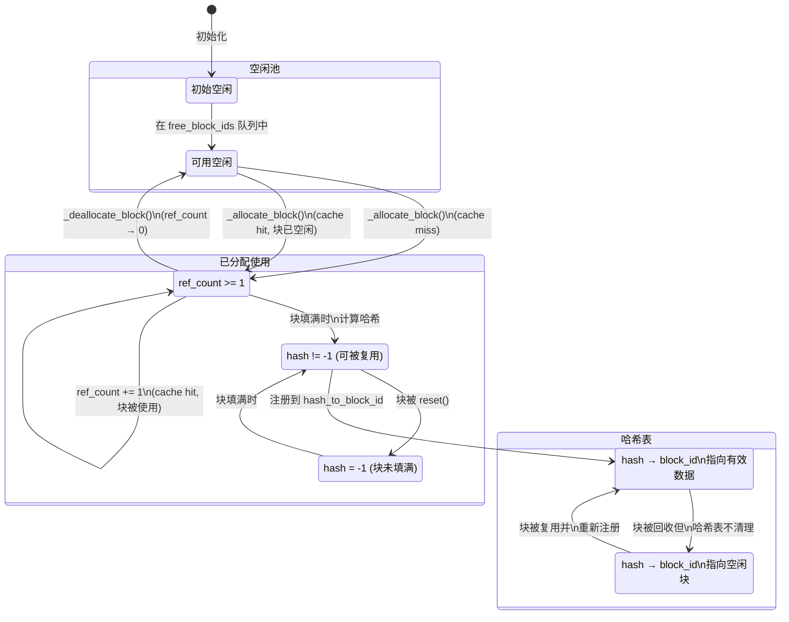
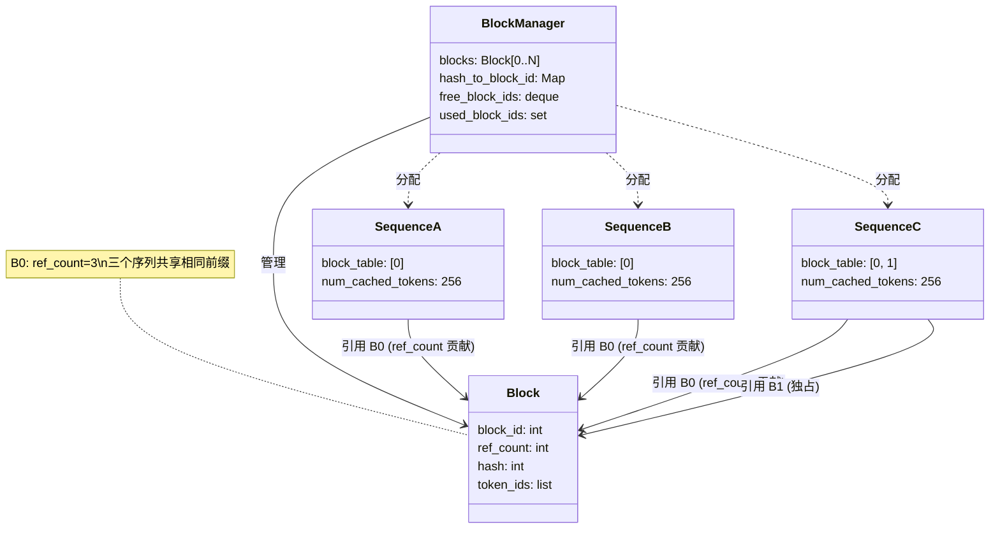
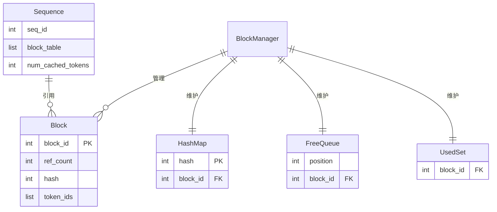

# BlockManager 块管理流程

## 1. 块状态转换图

```mermaid
stateDiagram-v2
    [*] --> 空闲状态 : Block 初始化
    
    state 空闲状态 {
        ref_count = 0
        hash = -1
        token_ids = []
        在 free_block_ids 队列中
    }
    
    state 已分配状态 {
        ref_count >= 1
        hash = 有效值/-1
        token_ids = 有效数据
        在 used_block_ids 集合中
    }
    
    state 哈希表注册状态 {
        在 hash_to_block_id 中
        可用于前缀缓存复用
    }
    
    空闲状态 --> 已分配状态 : _allocate_block()\n(分配新块/复用空闲块)
    已分配状态 --> 空闲状态 : _deallocate_block()\n(ref_count 降为 0)
    已分配状态 --> 哈希表注册状态 : 块填满时\n计算哈希并注册
```

## 2. 缓存未命中 (Cache Miss) 流程



## 3. 缓存命中 - 块被其他序列使用 (共享)



## 4. 缓存命中 - 块已空闲 (复用)



## 5. 块回收 (Deallocate) 流程



## 6. 块完全回收 (ref_count 降为 0)



## 7. 完整生命周期状态图



## 8. 多序列共享场景



## 9. 关键数据结构关系



## 10. 核心算法伪代码

### 10.1 数据结构定义

```pseudo
// KV Cache 块
class Block:
    block_id: int       // 物理块 ID (0 到 num_blocks-1)
    ref_count: int      // 引用计数 (0=空闲，>0=使用中)
    hash: int           // 哈希值 (-1=无效)
    token_ids: list     // 块中存储的 token IDs

// 块管理器
class BlockManager:
    blocks: List[Block]           // 所有物理块
    hash_to_block_id: Map[int, int]  // 哈希 → 块 ID 映射
    free_block_ids: deque[int]    // 空闲块 ID 队列 (FIFO)
    used_block_ids: set[int]      // 已使用块 ID 集合
    block_size: int               // 块大小 (默认 256)
```

### 10.2 块分配 (allocate)

```pseudo
function allocate(seq: Sequence):
    assert seq.block_table is empty
    
    h = -1                      // 前缀哈希初始值
    cache_miss = false
    
    // 遍历序列的每个逻辑块
    for i from 0 to seq.num_blocks - 1:
        token_ids = seq.block(i)  // 获取第 i 个块的 token IDs
        
        // 计算哈希 (仅完整块计算)
        if len(token_ids) == block_size:
            h = compute_hash(token_ids, h)  // 链式哈希
        else:
            h = -1
        
        // 查找哈希表
        block_id = hash_to_block_id.get(h, -1)
        
        // 检查缓存命中
        if block_id == -1 OR blocks[block_id].token_ids != token_ids:
            cache_miss = true
        
        if cache_miss:
            // === 缓存未命中：分配新块 ===
            block_id = free_block_ids[0]
            block = _allocate_block(block_id)
        else:
            // === 缓存命中：复用已有块 ===
            seq.num_cached_tokens += block_size
            
            if block_id in used_block_ids:
                // 块正被使用：增加引用计数 (共享)
                block = blocks[block_id]
                block.ref_count += 1
            else:
                // 块已空闲：重新分配
                block = _allocate_block(block_id)
        
        // 更新块信息并注册到哈希表
        if h != -1:
            block.update(h, token_ids)
            hash_to_block_id[h] = block_id
        
        // 加入序列的块表
        seq.block_table.append(block_id)
```

### 10.3 内部块分配 (_allocate_block)

```pseudo
function _allocate_block(block_id: int) -> Block:
    block = blocks[block_id]
    
    // 确保块是空闲的
    assert block.ref_count == 0
    
    // 重置块状态
    block.reset()
        block.ref_count = 1
        block.hash = -1
        block.token_ids = []
    
    // 更新管理器状态
    free_block_ids.remove(block_id)
    used_block_ids.add(block_id)
    
    return block
```

### 10.4 块回收 (deallocate)

```pseudo
function deallocate(seq: Sequence):
    // 逆序遍历块表
    for block_id in reverse(seq.block_table):
        block = blocks[block_id]
        
        // 引用计数减 1
        block.ref_count -= 1
        
        // 引用计数为 0 时真正回收
        if block.ref_count == 0:
            _deallocate_block(block_id)
    
    // 重置序列状态
    seq.num_cached_tokens = 0
    seq.block_table.clear()
```

### 10.5 内部块回收 (_deallocate_block)

```pseudo
function _deallocate_block(block_id: int):
    block = blocks[block_id]
    
    // 确保引用计数已为 0
    assert block.ref_count == 0
    
    // 从已使用集合移除，加入空闲队列
    used_block_ids.remove(block_id)
    free_block_ids.append(block_id)
    
    // 注意：不清空 block.hash 和 block.token_ids
    // 注意：不从 hash_to_block_id 删除条目
```

### 10.6 追加块 (may_append)

```pseudo
function may_append(seq: Sequence):
    block_table = seq.block_table
    last_block = blocks[block_table[-1]]
    
    if len(seq) % block_size == 1:
        // 情况 1：跨块边界，需要新块
        // 例如：256 → 257
        assert last_block.hash != -1
        
        block_id = free_block_ids[0]
        _allocate_block(block_id)
        block_table.append(block_id)
        
    else if len(seq) % block_size == 0:
        // 情况 2：块刚好填满，计算哈希
        // 例如：len=256, 512
        assert last_block.hash == -1
        
        token_ids = seq.block(seq.num_blocks - 1)
        
        // 计算前缀哈希
        if len(block_table) > 1:
            prefix = blocks[block_table[-2]].hash
        else:
            prefix = -1
        
        h = compute_hash(token_ids, prefix)
        
        // 更新块并注册到哈希表
        last_block.update(h, token_ids)
        hash_to_block_id[h] = last_block.block_id
        
    else:
        // 情况 3：块内追加，无需操作
        // 例如：257 → 300
        assert last_block.hash == -1
```

### 10.7 哈希计算 (compute_hash)

```pseudo
function compute_hash(token_ids: list[int], prefix: int) -> int:
    h = xxhash.xxh64()
    
    // 写入前缀哈希 (链式结构)
    if prefix != -1:
        h.update(prefix.to_bytes(8, "little"))
    
    // 写入 token IDs
    h.update(np.array(token_ids).tobytes())
    
    return h.intdigest()
```

## 11. 典型场景执行轨迹

### 场景 1：首次分配 (Cache Miss)

```
输入：SeqA = [1, 2, 3, ..., 256]  (完整 1 块)
初始状态：
  - free_block_ids = [0, 1, 2, ...]
  - used_block_ids = {}
  - hash_to_block_id = {}

执行轨迹:
  1. i=0: token_ids=[1..256], h=hash([1..256])
  2. hash_to_block_id.get(h) → -1 (未命中)
  3. cache_miss = true
  4. 从 free_block_ids 取出 0
  5. _allocate_block(0): 
       blocks[0].ref_count = 1
       used_block_ids = {0}
       free_block_ids = [1, 2, ...]
  6. blocks[0].update(h, [1..256])
  7. hash_to_block_id[h] = 0
  8. SeqA.block_table = [0]

最终状态:
  - blocks[0]: ref_count=1, hash=h, token_ids=[1..256]
  - used_block_ids = {0}
  - hash_to_block_id = {h: 0}
```

### 场景 2：缓存命中共享 (Cache Hit - Shared)

```
输入：SeqB = [1, 2, 3, ..., 256]  (与 SeqA 相同)
初始状态:
  - blocks[0]: ref_count=1 (被 SeqA 使用)
  - used_block_ids = {0}
  - hash_to_block_id = {h: 0}

执行轨迹:
  1. i=0: token_ids=[1..256], h=hash([1..256])
  2. hash_to_block_id.get(h) → 0 (命中)
  3. blocks[0].token_ids == [1..256] → 匹配
  4. cache_miss = false
  5. SeqB.num_cached_tokens = 256
  6. 0 in used_block_ids → true
  7. blocks[0].ref_count += 1 → 2
  8. blocks[0].update(h, [1..256]) (幂等)
  9. hash_to_block_id[h] = 0 (幂等)
  10. SeqB.block_table = [0]

最终状态:
  - blocks[0]: ref_count=2 (SeqA + SeqB 共享)
  - used_block_ids = {0}
  - hash_to_block_id = {h: 0}
```

### 场景 3：缓存命中复用 (Cache Hit - Reuse)

```
输入：SeqC = [1, 2, 3, ..., 256]  (与 SeqA/B 相同)
前置操作：SeqA 和 SeqB 已 dealloc
初始状态:
  - blocks[0]: ref_count=0 (已空闲)
  - used_block_ids = {}
  - free_block_ids = [0, 1, ...]
  - hash_to_block_id = {h: 0}  (条目保留!)

执行轨迹:
  1. i=0: token_ids=[1..256], h=hash([1..256])
  2. hash_to_block_id.get(h) → 0 (命中)
  3. blocks[0].token_ids == [1..256] → 匹配 (旧数据)
  4. cache_miss = false
  5. SeqC.num_cached_tokens = 256
  6. 0 in used_block_ids → false
  7. _allocate_block(0):
       blocks[0].reset()  // 清空旧数据!
       blocks[0].ref_count = 1
       used_block_ids = {0}
       free_block_ids = [1, 2, ...]
  8. blocks[0].update(h, [1..256])  // 重新注册
  9. hash_to_block_id[h] = 0  // 覆盖条目
  10. SeqC.block_table = [0]

最终状态:
  - blocks[0]: ref_count=1, hash=h, token_ids=[1..256]
  - used_block_ids = {0}
  - hash_to_block_id = {h: 0}
```

### 场景 4：多块序列

```
输入：SeqD = [1, 2, ..., 512]  (2 个完整块)
初始状态：假设块 0 已被使用

执行轨迹:
  // 第 1 块
  1. i=0: token_ids=[1..256], h1=hash([1..256])
  2. 分配/复用块 1
  3. SeqD.block_table = [1]
  
  // 第 2 块 (链式哈希)
  4. i=1: token_ids=[257..512]
  5. h2 = hash([257..512], prefix=h1)  // 链式
  6. 分配/复用块 2
  7. SeqD.block_table = [1, 2]

最终状态:
  - SeqD 引用两个物理块
  - 第 2 块的哈希依赖于第 1 块的哈希
```

### 场景 5：动态追加 (may_append)

```
输入：SeqE 从 256 tokens 增长到 257 tokens
初始状态:
  - SeqE = [1..256], block_table=[0]
  - blocks[0]: ref_count=1, hash=有效

执行轨迹 (len=256 → 257):
  1. len(seq) % 256 == 1 → 需要新块
  2. 从 free_block_ids 取出块 3
  3. _allocate_block(3)
  4. SeqE.block_table = [0, 3]
  5. blocks[3] 用于存储第 257 个 token

后续 (len=512):
  6. len(seq) % 256 == 0 → 计算哈希
  7. token_ids = SeqE.block(1)  // [257..512]
  8. prefix = blocks[0].hash
  9. h = hash(token_ids, prefix)
  10. blocks[3].update(h, token_ids)
  11. hash_to_block_id[h] = 3
```

</content>
</write_file>