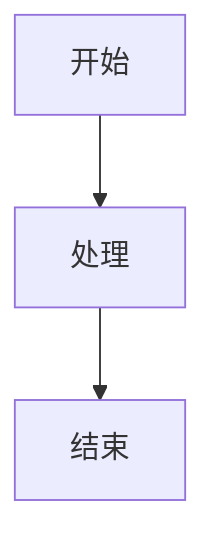

# Nano-vLLM 文档结构说明

> **本文档说明如何阅读和使用 Nano-vLLM 项目文档**

---

## 📚 文档组织原则

本文档按照**从宏观到微观**、**从底层到上层**、**从 Engine 到 Model**的原则组织，分为五个主要部分：

```
┌─────────────────────────────────────────────────────────────┐
│                      Nano-vLLM 文档体系                      │
├─────────────────────────────────────────────────────────────┤
│                                                             │
│  第一部分：入门指南                                          │
│  ├── 项目简介                                                │
│  ├── 快速开始                                                │
│  └── 学习路径                                                │
│                                                             │
│  第二部分：Engine 模块（推理引擎）                            │
│  ├── 基础数据结构：Sequence                                  │
│  ├── 资源管理：BlockManager                                  │
│  ├── 调度策略：Scheduler                                     │
│  ├── 模型执行：ModelRunner                                   │
│  └── 引擎总控：LLMEngine                                     │
│                                                             │
│  第三部分：Model 模块（模型架构）                            │
│  ├── Qwen3 模型总览                                          │
│  ├── 注意力机制                                              │
│  ├── 并行线性层                                              │
│  ├── 位置编码与采样器                                        │
│  └── 嵌入层与输出头                                          │
│                                                             │
│  第四部分：vLLM 核心创新                                     │
│  ├── PagedAttention                                          │
│  ├── Continuous Batching                                     │
│  └── 显存管理                                                │
│                                                             │
│  第五部分：部署与参考                                        │
│  ├── 文档部署说明                                            │
│  └── 术语表                                                  │
│                                                             │
└─────────────────────────────────────────────────────────────┘
```

---

## 📖 文档分类

### 第一部分：入门指南

| 文档 | 说明 | 推荐阅读 |
|------|------|----------|
| [index.md](index.md) | 文档首页，项目概览 | ⭐⭐⭐ |
| [01-intro.md](01-intro.md) | 项目上下文和核心概念 | ⭐⭐⭐ |
| [02-architecture.md](02-architecture.md) | 整体架构设计 | ⭐⭐⭐ |
| [03-engine-learning-order.md](03-engine-learning-order.md) | 推荐学习路径 | ⭐⭐ |

**适合人群**：初次接触项目的读者

---

### 第二部分：Engine 模块详解

Engine 模块是推理引擎的核心，按照**依赖关系从下到上**组织：

#### 2.1 基础数据结构

| 文档 | 说明 | 核心内容 |
|------|------|----------|
| [04-sequence-design.md](04-sequence-design.md) | Sequence 设计说明 | 序列数据类、状态机、KV Cache 块表 |

#### 2.2 资源管理

| 文档 | 说明 | 核心内容 |
|------|------|----------|
| [05-block-manager-design.md](05-block-manager-design.md) | BlockManager 设计 | 前缀缓存、引用计数、链式哈希 |
| [06-block-manager-flow.md](06-block-manager-flow.md) | BlockManager 流程 | 状态转换、缓存命中流程、生命周期 |

#### 2.3 调度策略

| 文档 | 说明 | 核心内容 |
|------|------|----------|
| [07-scheduler-flow.md](07-scheduler-flow.md) | Scheduler 调度流程 | 两阶段调度、抢占机制、资源管理 |

#### 2.4 模型执行

| 文档 | 说明 | 核心内容 |
|------|------|----------|
| [model_runner.md](model_runner.md) | ModelRunner 模型执行器 | 模型加载、KV Cache 分配、CUDA 图 |

**依赖关系**：
```
Sequence → BlockManager → Scheduler → LLMEngine
                        ↗
                  ModelRunner
```

**适合人群**：想深入理解推理引擎工作原理的读者

---

### 第三部分：Model 模块详解

Model 模块是模型架构的实现，按照**数据流从输入到输出**组织：

#### 3.1 模型总览

| 文档 | 说明 | 核心内容 |
|------|------|----------|
| [09-model-qwen3.md](09-model-qwen3.md) | Qwen3 模型架构 | 完整层级结构、数据流图 |

#### 3.2 核心组件

| 文档 | 说明 | 核心内容 |
|------|------|----------|
| [10-embed-head.md](10-embed-head.md) | 嵌入层与输出头 | 词汇表并行、LM Head |
| [08-model_attention.md](08-model_attention.md) | 注意力机制 | Triton Kernel、Flash Attention |
| [16-attention.md](16-attention.md) | Attention 详解 | KV Cache 管理、Prefill/Decode |
| [12-linear.md](12-linear.md) | 并行线性层 | 列并行、行并行、QKV 并行 |
| [11-tensor-parallel.md](11-tensor-parallel.md) | 张量并行基础 | tp_rank、tp_size |
| [13-parallel-decision.md](13-parallel-decision.md) | 并行决策机制 | 权重加载、并行方式决定 |
| [14-rope-and-lru-cache.md](14-rope-and-lru-cache.md) | RoPE 与 LRU Cache | 旋转位置编码、缓存优化 |
| [15-sampler.md](15-sampler.md) | 采样器 | Gumbel-Max 技巧、温度采样 |

**数据流**：
```
输入 → Embedding → Attention → MLP → LM Head → Sampler → 输出
              │           │      │
              │           │      └─ 并行线性层
              │           └─ RoPE
              └─ 词汇表并行
```

**适合人群**：想深入理解模型架构和张量并行的读者

---

### 第四部分：vLLM 核心创新

| 文档 | 说明 | 核心内容 |
|------|------|----------|
| [vllm-innovations.md](vllm-innovations.md) | vLLM 核心创新解析 | PagedAttention、Continuous Batching |

**适合人群**：想理解 vLLM 设计思想的读者

---

### 第五部分：部署与参考

| 文档 | 说明 | 核心内容 |
|------|------|----------|
| [DEPLOY.md](DEPLOY.md) | 文档部署说明 | MkDocs 配置、GitHub Pages 部署 |

---

## 🗺️ 学习路径推荐

### 路径 1：快速入门（2-3 小时）

```
index.md → 01-intro.md → 02-architecture.md → example.py
```

**目标**：了解项目能做什么，如何运行

---

### 路径 2：Engine 模块深入（6-8 小时）

```
03-engine-learning-order.md → 04-sequence-design.md 
→ 05-block-manager-design.md → 06-block-manager-flow.md 
→ 07-scheduler-flow.md → model_runner.md
```

**目标**：理解推理引擎的工作原理

---

### 路径 3：Model 模块深入（8-10 小时）

```
09-model-qwen3.md → 10-embed-head.md → 08-model_attention.md 
→ 16-attention.md → 12-linear.md → 11-tensor-parallel.md 
→ 13-parallel-decision.md → 14-rope-and-lru-cache.md 
→ 15-sampler.md
```

**目标**：理解模型架构和张量并行实现

---

### 路径 4：完整学习（20-30 小时）

```
路径 1 → 路径 2 → 路径 3 → vllm-innovations.md
```

**目标**：全面掌握 Nano-vLLM 的设计和实现

---

## 📊 文档难度标识

文档按照难度分为三个等级：

| 标识 | 难度 | 说明 |
|------|------|------|
| ⭐ | 入门 | 概念介绍，无需背景知识 |
| ⭐⭐ | 进阶 | 需要一定深度学习基础 |
| ⭐⭐⭐ | 高级 | 需要深入理解 Transformer 和分布式系统 |

### 各文档难度

```
入门指南：
  index.md                  ⭐
  01-intro.md               ⭐
  02-architecture.md        ⭐⭐
  03-engine-learning-order.md ⭐

Engine 模块：
  04-sequence-design.md     ⭐⭐
  05-block-manager-design.md ⭐⭐⭐
  06-block-manager-flow.md   ⭐⭐⭐
  07-scheduler-flow.md       ⭐⭐⭐
  model_runner.md            ⭐⭐⭐

Model 模块：
  09-model-qwen3.md          ⭐⭐
  10-embed-head.md           ⭐⭐⭐
  08-model_attention.md      ⭐⭐⭐
  16-attention.md            ⭐⭐⭐
  12-linear.md               ⭐⭐⭐
  11-tensor-parallel.md      ⭐⭐
  13-parallel-decision.md    ⭐⭐⭐
  14-rope-and-lru-cache.md   ⭐⭐
  15-sampler.md              ⭐⭐

vLLM 创新：
  vllm-innovations.md        ⭐⭐⭐

部署：
  DEPLOY.md                  ⭐
```

---

## 🔧 文档使用技巧

### 1. 使用 Mermaid 图表

文档中大量使用 Mermaid 图表展示流程和结构：

````markdown

````

**提示**：确保你的 Markdown 编辑器支持 Mermaid 渲染

---

### 2. 使用数学公式

文档使用 MathJax 渲染数学公式：

````markdown
行内公式：\( E = mc^2 \)

块级公式：
\[ \begin{bmatrix} y_1 \\ y_2 \end{bmatrix} = \begin{bmatrix} \cos\theta & -\sin\theta \\ \sin\theta & \cos\theta \end{bmatrix} \begin{bmatrix} x_1 \\ x_2 \end{bmatrix} \]
```
````

---

### 3. 代码示例

所有代码示例都可直接在项目中找到对应实现：

```python
# 示例代码位置：nanovllm/engine/scheduler.py
def schedule(self):
    # ... 代码实现
```

---

## 📝 文档更新记录

| 日期 | 更新内容 |
|------|----------|
| 2024-XX-XX | 初始版本 |
| 2024-XX-XX | 添加 Engine 模块文档 |
| 2024-XX-XX | 添加 Model 模块文档 |
| 2024-XX-XX | 重构文档结构 |

---

## 🔗 相关链接

- [GitHub 仓库](https://github.com/Xjg-0216/nano-vllm)
- [vLLM 原项目](https://github.com/vllm-project/vllm)
- [MkDocs 文档](https://www.mkdocs.org/)
- [Material for MkDocs](https://squidfunk.github.io/mkdocs-material/)

---

**最后更新**: 2024 年
